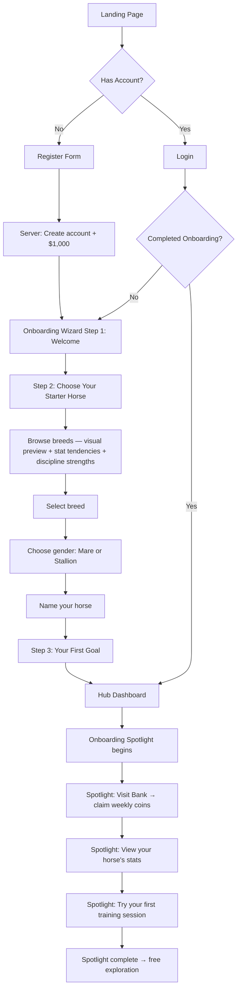
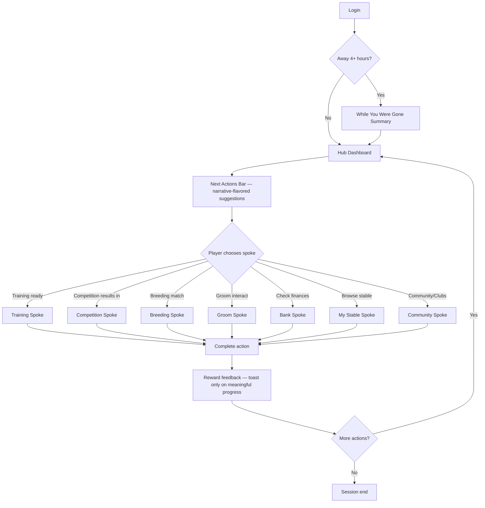
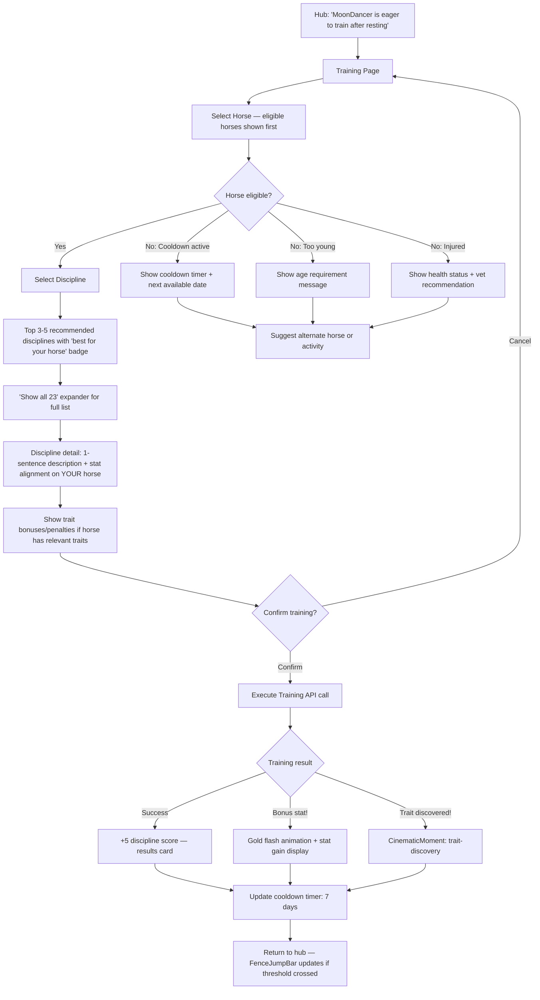
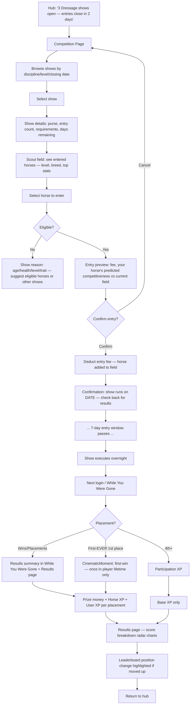
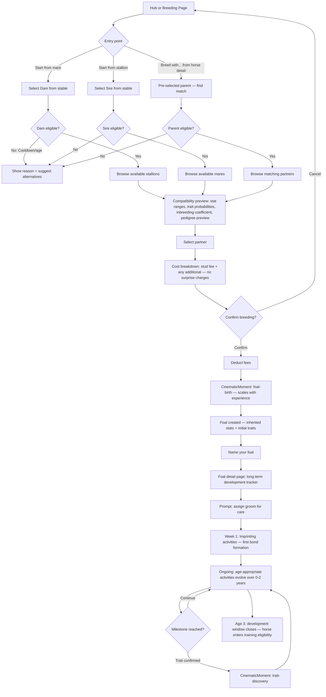
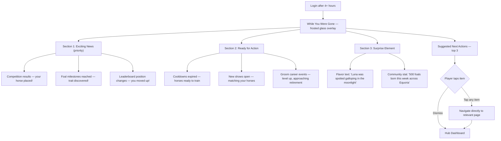

# UX Design Specification: Equoria

**Author:** Heirr
**Date:** 2026-03-10

---

## Executive Summary

### Project Vision

Equoria is a browser-based horse breeding and competition simulation with deep strategic systems, presented through an immersive Celestial Night fantasy aesthetic. Players enter a world of midnight skies, gold typography, and frosted glass — not a website, but a game world they inhabit.

The game is fully functional (20 epics, 3,651 backend tests, ~30 frontend pages) but the frontend uses generic developer UI. This UX specification defines the complete Celestial Night design system and page-by-page transformation plan to deliver the intended experience.

### Target Users (Validated by Focus Group)

- **Strategic Breeders (Sarah, 28)** — Need HIGH-CONTRAST stat readability within frosted glass; tab-heavy navigation for quick data switching; keyboard-navigable interfaces. The aesthetic must enhance, not hinder, information density.
- **Casual Competitors (Mike, 19)** — Need GAME-NATIVE patterns: countdown timers, slot grids, victory overlays with celestial visual effects. Urgency and reward must be visceral.
- **Horse Enthusiasts (Emma, 42)** — Need AUTHENTIC equestrian terminology from the data model, not gamified substitutes. The twilight-field atmosphere resonates with real horse experience. Premium aesthetic signals respect for the subject.
- **Collectors (Alex, 16)** — Need DISCOVERY VISUALIZATION: trait discovery as constellation building, slot-based inventory grids, satisfying scroll-through of frosted glass cards. Completion tracking that feels magical.

### Key Design Challenges

1. **Information Density vs. Atmosphere** — 10 stats, 23 disciplines, genetics, grooms, riders, trainers must live inside beautiful frosted glass without becoming spreadsheets. Solution: high-contrast gold-on-navy with clear numeric labels on every stat bar.
2. **Game Screens, Not Web Pages** — Transform standard web patterns into atmospheric game screens with slot grids, iconography-first hierarchy, and environmental backgrounds. Every surface needs atmosphere (starfield, silhouettes, gradient sky).
3. **Total Visual Consistency** — Replace ALL generic Tailwind/shadcn defaults. No page should feel like it belongs to a different app. 8 core components cover 90% of surfaces.
4. **Layered Implementation** — Global atmosphere (Layer 1) → Container system (Layer 2) → Typography (Layer 3) → Component polish (Layer 4). Each layer independently shippable.

### Design Opportunities

1. **Atmospheric Immersion** — Horse silhouette backgrounds, starfield particles, moon motifs. No competitor looks like this.
2. **Celestial Reward Vocabulary** — Wins = golden star bursts, trait discovery = constellations forming, foal birth = shooting stars. Built-in emotional language.
3. **Premium Typography** — Serif display font (Cinzel/Cormorant Garamond) for headers immediately signals "fantasy game world."
4. **Constellation Collection System** — Trait discovery visualized as stars joining constellations. Completed sets light up permanently. Collector's dream.
5. **8-Component Design System** — FrostedPanel, CelestialButton, GlassInput, GoldTabs, StatBar, SlotGrid, StarfieldBackground, CrescentDecoration cover 90% of all surfaces.

### Implementation Strategy (from War Room)

| Layer                | What                                     | Impact                   | Effort |
| -------------------- | ---------------------------------------- | ------------------------ | ------ |
| 1. Global Atmosphere | Celestial gradient BG + star particles   | Every page transforms    | Low    |
| 2. Container System  | FrostedPanel replaces all Cards          | Game-feel on all content | Medium |
| 3. Typography        | Serif display font for headers           | Premium fantasy feel     | Low    |
| 4. Component Polish  | Buttons, inputs, tabs, stat bars, modals | Complete experience      | High   |

Pages needing layout changes (not just reskin): Dashboard, HorseDetail, Competitions, Stable, Search, Inventory, Sidebar Nav (~7 pages). Remaining ~5 pages are reskin-only.

### Design Token Extraction (from Reference Images)

#### Color Palette

```
BACKGROUNDS:
--bg-deep-space:      #0a0e1a    (darkest, page edges)
--bg-night-sky:       #111827    (primary background)
--bg-midnight:        #1a2236    (secondary/elevated surfaces)
--bg-twilight:        #243154    (hover states, active areas)

FROSTED GLASS:
--glass-bg:           rgba(15, 23, 42, 0.6)    (panel background)
--glass-border:       rgba(148, 163, 184, 0.2)  (subtle border)
--glass-hover:        rgba(148, 163, 184, 0.3)  (hover border)
--glass-blur:         12px                        (backdrop-filter)

GOLD ACCENTS:
--gold-primary:       #c8a84e    (large headers, active elements)
--gold-light:         #e8d48b    (body text on dark, hover highlights)
--gold-dim:           #8b7635    (subtle accents, inactive)

TEXT:
--text-primary:       #e2e8f0    (body text - high contrast)
--text-secondary:     #94a3b8    (labels, captions)
--text-gold:          #c8a84e    (headers, emphasis)
--text-muted:         #64748b    (disabled, placeholder)

INTERACTIVE:
--btn-primary-bg:     rgba(59, 130, 246, 0.3)   (blue frosted button)
--btn-primary-border: rgba(59, 130, 246, 0.5)
--btn-gold-bg:        rgba(200, 168, 78, 0.2)   (gold frosted button)
--btn-gold-border:    rgba(200, 168, 78, 0.4)

STATUS:
--status-success:     #4ade80    (green glow)
--status-warning:     #fbbf24    (amber glow)
--status-danger:      #f87171    (red glow)

STAT BARS:
--bar-fill:           linear-gradient(90deg, #3b82f6, #60a5fa)
--bar-bg:             rgba(30, 41, 59, 0.8)
--bar-text:           #e2e8f0    (numeric overlay)
```

#### Typography

```
DISPLAY (Headers):
--font-display:       'Cinzel', 'Cormorant Garamond', Georgia, serif
Weights: 400 (section), 600 (page titles), 700 (brand)
Letter-spacing: 0.05em (uppercase), normal (mixed case)

BODY:
--font-body:          'Inter', system-ui, sans-serif
Weights: 400 (body), 500 (labels), 600 (emphasis)

SCALE:
--text-brand:         2.5rem    (EQUORIA logo)
--text-page-title:    1.75rem   (page headers)
--text-section:       1.25rem   (section headers)
--text-body:          0.875rem  (body)
--text-caption:       0.75rem   (labels, timestamps)
```

#### Core Component Patterns

```
FROSTED PANEL:        backdrop-filter blur, rgba bg, subtle border, 12px radius
BUTTONS (3 variants): Primary (blue frost), Gold (gold border), Ghost (transparent + gold text)
INPUTS:               Frosted bg, left icon, gold placeholder, rounded-lg
TABS:                 Transparent bg, gold active text, gold underline indicator
STAT BARS:            Rounded-full, dark track, gradient fill, numeric overlay
SLOT GRID:            Fixed squares, dashed empty state, portrait + label when filled
NAVIGATION SIDEBAR:   Dark panel, ornate border, gold horse logo, gold icons
DECORATIVE:           Crescent moon headers, sparkle icons, horse silhouette backgrounds
```

### Pre-mortem Risk Prevention

| Risk                         | Severity   | Prevention                                                                                                                                                                 | Gate                 |
| ---------------------------- | ---------- | -------------------------------------------------------------------------------------------------------------------------------------------------------------------------- | -------------------- |
| **Contrast failure**         | Critical   | Validate all color pairs against WCAG AA before coding; use `--gold-light` (#e8d48b) for body text (7.1:1 ratio), reserve `--gold-primary` for large headers only          | Color audit document |
| **Performance (minor)**      | Low        | Use `backdrop-filter` on overlays/modals only; solid semi-transparent bg for cards; this is a simulation game, not a 3D renderer — static UI performs fine on any hardware | Common sense         |
| **Inconsistent half-state**  | High       | Layers 1-3 ship atomically as single change; Layer 4 per-component not per-page; no partial deployment                                                                     | All-or-nothing gate  |
| **Font loading flash**       | Medium     | Self-host Cinzel (subset Latin, ~25KB); preload in `<head>`; `font-display: optional`                                                                                      | First-paint test     |
| **Broken functionality**     | Critical   | Full test suite (3,651 + Playwright) after every page reskin; CSS-first changes before DOM restructuring; visual regression snapshots as baseline                          | All tests pass       |
| **Accessibility regression** | Critical   | ARIA audit per replaced component; gold glow focus rings (`box-shadow`); keyboard navigation test; Lighthouse a11y >= 0.85                                                 | Lighthouse gate      |
| **Rollback plan**            | Safety net | Each layer is one CSS import or one component swap — single-line revert if needed                                                                                          | Architecture review  |

## Core User Experience

### Defining Experience

The core experience of Equoria centers on the **Stable Dashboard** as home base — the first screen after login, the screen players return to between every action. It must answer at a glance: "What can I do right now?" Which horses are ready to train, which competitions are open, which mares are off cooldown for breeding.

**The Core Loop:** Stable → Train → Compete → Breed → Repeat

Each phase of the loop has its own rhythm:

- **Stable:** Survey, plan, decide (calm, atmospheric, informational)
- **Train:** Select horse, pick discipline, confirm (quick, purposeful)
- **Compete:** Browse competitions individually, select horse per competition, watch results (deliberate, exciting)
- **Breed:** Check compatibility, select pair, anticipate outcome (strategic, hopeful)

Competition entry is deliberately per-competition — players must browse available competitions, click into each one, evaluate it, then select which horse to enter. This is a strategic decision, not a batch operation. The UX must make browsing competitions enjoyable and each entry feel like a meaningful choice.

### Platform Strategy

**Platform:** Responsive browser game — accessed via URL on any device with a browser. Not a downloadable app. Not an animated/3D game.

**Device Matrix:**

- Desktop/laptop (mouse + keyboard) — full experience, wider layouts
- Tablet (touch, landscape/portrait) — full experience, touch-optimized targets
- Phone (touch, portrait) — full experience, stacked layouts, larger tap targets

**Critical requirement:** The game must be **equally playable** on phone and desktop. This is not "desktop-first with mobile as afterthought" — both are primary. The Celestial Night aesthetic must feel immersive on a 5-inch phone screen just as much as on a 27-inch monitor.

**Design implications:**

- All interactive elements: minimum 44px touch targets
- Navigation: hamburger menu on mobile, sidebar on desktop (already implemented)
- Frosted panels: stack vertically on mobile, grid on desktop
- Stat bars and horse detail tabs: must work in portrait phone width
- No hover-only interactions — everything accessible via tap
- Font sizes must be readable without pinch-zoom

### Effortless Interactions

These interactions must feel instant and require zero friction:

1. **Horse readiness at a glance** — The stable dashboard shows each horse's status visually: ready to train (glow), in cooldown (timer), needs care (alert). No clicking into individual horses just to check status.

2. **Breeding compatibility check** — Side-by-side comparison accessible from any horse's detail page. Genetic compatibility, predicted trait outcomes, and cooldown status visible without navigating away.

3. **Quick navigation between horses** — From any horse detail view, swipe or arrow to next/previous horse. No back-to-list-then-click-next pattern.

4. **Session resumption** — When returning to the game, immediately see what changed since last visit: training completed, competition results in, cooldowns expired.

### Critical Success Moments

The "hook moment" varies by persona — the UX must support ALL of these as potential conversion points:

| Moment                    | Persona           | UX Requirement                                           |
| ------------------------- | ----------------- | -------------------------------------------------------- |
| **First trait discovery** | Collector (Alex)  | Constellation-forming cinematic, permanent visual record |
| **First foal born**       | Breeder (Sarah)   | Shooting star cinematic, immediate stat/trait preview    |
| **First competition win** | Competitor (Mike) | Victory overlay with star burst, leaderboard position    |
| **First stat increase**   | Enthusiast (Emma) | Visible bar growth animation, XP progress feedback       |
| **First rare find**       | All               | Special golden glow treatment, collection notification   |

**Make-or-break flows:**

- **Onboarding → first meaningful action** — If a new player can't figure out what to do within 60 seconds of their first login, we've lost them. The onboarding spotlight system (Epic 17) must guide them to their first win/discovery.
- **Competition entry flow** — Must feel deliberate and exciting, not tedious. Each competition card should sell itself: name, prize, countdown, difficulty signal.
- **Horse detail navigation** — Players spend more time here than anywhere. Tabs must load instantly, data must be scannable, actions must be reachable.

### Experience Principles

1. **Atmosphere First, Information Within** — Every screen is a place in the celestial world first, a data display second. Information lives inside the atmosphere, not on top of it.

2. **Glanceable Status, Deep on Demand** — Surface-level status visible without interaction (horse cards show readiness). Full detail available one tap/click deeper. Never force users to dig for routine information.

3. **Every Action is a Choice** — Competition entry, breeding pairs, training discipline — each decision point should feel strategic and meaningful, not like a checkbox. The UI should present information that helps the player decide, not just confirm.

4. **Equal Experience Across Devices** — A player on their phone during lunch and on their laptop at home should have the same quality experience. Responsive is not "smaller" — it's "adapted."

5. **Reward Every Milestone** — The celestial theme provides a rich visual vocabulary for celebration. Use it generously. No achievement should pass without visual acknowledgment — stars, constellations, golden light, cinematic moments.

## Desired Emotional Response

### Emotional Spectrum

Equoria's emotional design operates as a **spectrum**, not a single note. The Celestial Night theme provides the range — from quiet midnight to blazing supernova — within one cohesive visual language.

**Resting State: Calm Awe** — The default emotion. Stepping into a stable at twilight. Deep navy gradients, soft star twinkle, gold accents. This is the foundation that every screen returns to between actions.

**Planning State: Focused Flow** — When deep in breeding pairs, stat comparisons, or pedigree analysis. The atmosphere fades to background; data takes foreground. The calm persists but attention narrows. Like music lowering when dialogue starts.

**Active State: Excited Anticipation** — Browsing competitions, entering horses, waiting for results. Countdown timers, event names, prize previews build energy. The midnight sky charges with electricity. Stars brighten.

**Peak State: Radiant Elation** — Winning, discovering rare traits, witnessing foal birth. Full cinematic moments — golden starbursts on midnight, constellation formations, shooting stars. The theme's crescendo.

**Return State: Warm Anticipation** — Coming back to check on progress. "What happened while I was away?" Training complete, results in, cooldowns expired. The stable awaits like a warm home with the lights on.

### Primary Emotional Goals

1. **Calm Awe on Entry** — Opening Equoria feels like stepping into a stable at twilight. The Celestial Night aesthetic creates immediate sanctuary. Players exhale, not brace.

2. **Strategic Pride During Play** — Smart decisions are satisfying. Picking the right discipline, finding the right pair, spotting the right opportunity. Players feel clever and in control.

3. **Radiant Pride on Achievement** — The "tell a friend" emotion. Every horse bred, trait discovered, and competition won is beautiful enough to screenshot and share.

4. **Attachment Through Care** — The 3-week groom care period for foals builds genuine emotional bonding. When that foal grows up and wins its first competition, the player feels like a proud parent. This emotional continuity — from care to achievement — is the deepest retention hook.

5. **Discovery Anticipation** — The moment BEFORE a reveal is the emotional peak. The trait reveal animation building, competition results appearing one by one, the foal birth sequence unfolding. These transition moments deserve maximum design investment.

### Emotional Journey Mapping

| Stage                      | Emotion              | Design Expression                                                                     |
| -------------------------- | -------------------- | ------------------------------------------------------------------------------------- |
| **First visit**            | Wonder + curiosity   | Celestial login, atmospheric backgrounds, gold typography signals "this is different" |
| **Onboarding**             | Guided confidence    | Spotlight tutorial, immediate reward (starter horse), no overwhelm                    |
| **Stable (home)**          | Calm ownership       | Atmospheric dashboard, glanceable status, "my world" feeling                          |
| **Training**               | Purposeful focus     | Quick action, clear choice, visible stat change                                       |
| **Competition browsing**   | Excited anticipation | Each card sells itself — name, prize, countdown, challenge level                      |
| **Competition results**    | Bulk satisfaction    | Wins accumulate naturally; individual losses don't sting                              |
| **Breeding selection**     | Strategic hope       | Compatibility preview builds anticipation; deliberate pairing                         |
| **Foal birth**             | Joyful wonder        | Shooting star cinematic; immediate stat/trait preview                                 |
| **Groom care (0-3 weeks)** | Nurturing attachment | Daily care choices shape the foal; bonding through investment                         |
| **Trait discovery**        | Delighted surprise   | Constellation-forming animation; rare finds get golden glow                           |
| **Foal grows → competes**  | Proud parent         | Callback to early care investment; emotional continuity payoff                        |
| **Session end**            | Satisfied + planning | Clear "next time" signals; no unfinished anxiety                                      |

### Micro-Emotions

**Confidence over Confusion** — Every screen makes the player feel they know what to do. The atmosphere is mysterious; the interface is crystal clear. Gold headings and consistent layout patterns create reliable visual anchoring.

**Pride over Frustration** — The game's emotional floor is high. Competitions are entered in bulk (losses don't sting individually), breeding always produces a foal, negative epigenetic traits can be corrected via grooms within 3 weeks. Players are never punished.

**Excitement over Anxiety** — Countdown timers frame opportunity ("Enter by 8h 12m"), not scarcity ("Only 8h left!"). Positive framing in all time-sensitive elements.

**Anticipation over Impatience** — Reveals are slow and ceremonial. Trait discoveries build star by star. Competition results appear horse by horse. The wait IS the experience, not an obstacle to the experience.

**Belonging over Isolation** — The celestial world is the player's home. Their stable is their corner of this universe. Community extends the world, not fragments it.

**Attachment over Detachment** — Horses are not inventory items. They have names, personalities, histories. The care period creates bonds. Design should reinforce individuality — each horse's detail page feels like THEIR page.

### Emotions to Prevent

| Negative Emotion   | Guardrail                                                                                                          |
| ------------------ | ------------------------------------------------------------------------------------------------------------------ |
| **Overwhelm**      | Dashboard shows "ready now" actions, not everything at once; progressive disclosure                                |
| **FOMO / guilt**   | No "you missed this!" notifications; competitions recur; no punishing absence                                      |
| **Confusion**      | Consistent patterns, clear labels, onboarding spotlight, real equestrian terminology                               |
| **Regret**         | No irreversible mistakes; epigenetic correction window; no "are you sure?" anxiety for routine actions             |
| **Boredom**        | Varied visual rhythm (calm → exciting → calm); each screen has visual interest; celestial theme prevents sterility |
| **Shame**          | No public loss display; leaderboards show achievement, not failure; no "you lost" prominently                      |
| **Visual fatigue** | Dark theme is easy on eyes (especially nighttime play); no harsh whites or flashing elements                       |

### Design Implications

| Emotion                                 | UX Design Approach                                                                                       |
| --------------------------------------- | -------------------------------------------------------------------------------------------------------- |
| **Calm awe**                            | Deep gradients, slow subtle animations (star twinkle), generous spacing within frosted panels            |
| **Focused flow**                        | When data is foreground, atmosphere dims — lower panel opacity, higher text contrast, tighter spacing    |
| **Excited anticipation**                | Competition cards use bolder gold, subtle pulse on countdown timers, brighter star accents               |
| **Radiant elation**                     | Full cinematic overlays, golden particle effects, constellation animations, sound design opportunity     |
| **Discovery anticipation**              | Slow reveal animations with build-up; momentary pause before results; progressive disclosure of outcomes |
| **Attachment**                          | Horse portraits are prominent and beautiful; names displayed with pride; care history accessible         |
| **Confidence**                          | Consistent layout patterns page-to-page; gold headings as reliable anchors; no surprise navigation       |
| **"Pretty door, ugly room" prevention** | EVERY page matches the login screen's quality — same celestial depth, same gold accents, same atmosphere |

### Emotional Validation Metrics

| Emotional Goal             | Measurable Proxy                | Target                           |
| -------------------------- | ------------------------------- | -------------------------------- |
| **Calm sanctuary**         | Average session duration        | 15+ minutes                      |
| **Warm anticipation**      | Return rate                     | 3+ sessions per week             |
| **Radiant pride**          | Share/screenshot actions        | Track share button clicks        |
| **Confidence**             | Flow completion rate            | >80% of started flows completed  |
| **Excited anticipation**   | Competition entries per session | Track avg entries                |
| **Attachment**             | Foals raised to adulthood       | >70% of foals reach training age |
| **Discovery anticipation** | Time spent on reveal animations | Players don't skip reveals       |

### Emotional Design Principles

1. **Sanctuary, Not Arena** — The game world is a beautiful place to spend time. Every design choice makes players want to linger, not rush. The celestial night is calm, safe, restorative.

2. **Emotional Range Within Theme** — Calm awe is the bass note, not the only note. The celestial theme scales from quiet midnight (browsing) to blazing supernova (winning). Same visual language, different intensity.

3. **High Emotional Floor** — No devastating losses, no irreversible mistakes, always a path forward. Design reflects safety — no alarming reds for routine states, no harsh warnings, no punishment mechanics.

4. **Anticipation is the Peak** — The moment before a reveal is more exciting than the reveal itself. Invest maximum design effort in transition moments: trait animations, result sequences, foal birth builds.

5. **Attachment Through Care** — The 3-week groom period is an emotional bonding window. Adult achievements callback to early care. Horses are individuals, not inventory items.

6. **Pride is the Product** — Everything the player creates should look beautiful enough to screenshot and share. The Celestial Night theme makes every page inherently shareable. If it's not screenshot-worthy, redesign it.

7. **Quiet Brilliance** — Golden starbursts on midnight sky are more powerful than confetti on white. Let the dark theme amplify celebrations through contrast, not compete with them.

## UX Pattern Analysis & Inspiration

### Inspiring Products Analysis

#### Horseland (Legacy — Community Model)

- **What it did right:** Created lifelong friendships. Players from 28 years ago are still friends today. The game was the REASON to gather, but the community was the product.
- **UX lesson:** Community features aren't secondary — they're the long-term retention engine. Message boards, clubs, direct messages need to feel like first-class citizens, not bolted-on features.
- **Transferable:** The game itself creates shared context for relationships. Every horse bred, competition won, and trait discovered is a conversation starter.

#### The Last Unicorn (1982 film — Visual & Emotional Tone)

- **What it does right:** Deep blue night skies, silver moonlight, ethereal atmosphere. Creatures treated as sacred, not cartoonish. Beauty and melancholy coexist. The art direction is simultaneously magical and grounded.
- **UX lesson:** The Celestial Night aesthetic should channel this — horses in Equoria are not cute collectibles, they're noble creatures in a magical world. The visual language should convey reverence, not whimsy.
- **Transferable color palette:** Deep midnight blue skies, silver/white moonlight on dark landscapes, warm gold for magical elements, dark forests as framing, stars as quiet witnesses.

#### Unico (graphic novel/film — Emotional Register)

- **What it does right:** Tenderness toward creatures. Emotional bonds between characters and animals drive the story. Magic is gentle, not explosive. The world is beautiful but has weight — actions and care matter.
- **UX lesson:** The care-and-bonding loop (groom → foal → adult) should feel like Unico's emotional core — genuine attachment, not just mechanics. The UI should make horses feel like beings you're responsible for, not assets you manage.
- **Transferable:** Gentle magic over flashy effects. Warm emotional moments within a larger mysterious world. The feeling that kindness and care produce real results.

### Visual Tone Synthesis

The intersection of Last Unicorn + Unico + Celestial Night:

| Element       | Last Unicorn                          | Unico                                  | Equoria Application                                                 |
| ------------- | ------------------------------------- | -------------------------------------- | ------------------------------------------------------------------- |
| **Sky**       | Deep indigo, star-scattered           | Soft twilight blues                    | Midnight gradient with subtle stars                                 |
| **Light**     | Silver moonlight, ethereal glow       | Warm gold magical light                | Gold accents on silver/blue base                                    |
| **Creatures** | Noble, sacred, graceful               | Tender, cared-for, emotional           | Horses are dignified individuals, not cartoon mascots               |
| **Magic**     | Ancient, mysterious, transformative   | Gentle, healing, connected to love     | Trait discovery, foal birth, achievements feel magical but grounded |
| **Emotion**   | Awe + melancholy + hope               | Tenderness + wonder + attachment       | Calm awe + attachment + pride                                       |
| **World**     | Dark forest, moonlit meadow, vast sky | Enchanted landscapes, intimate moments | Celestial stable grounds, atmospheric backgrounds                   |

### Transferable UX Patterns

#### From Horse Game Legacy (Horseland/Howrse)

- **Community as retention:** The game creates shared context; friendships keep players for decades. Invest equally in community UX as in game UX.
- **Stable as identity:** A player's stable IS their identity in the community. Stable pages should be profile pages — shareable, customizable, pride-inducing.
- **Horse lineage as storytelling:** Multi-generation breeding creates stories players tell each other. Pedigree trees should be beautiful and shareable.

#### From 80s Fantasy Anime (Last Unicorn/Unico)

- **Reverence over cuteness:** Horses are noble, not chibi. The art style should reflect dignity. No bobblehead proportions, no excessive sparkle.
- **Gentle magic:** Animations and effects should feel like moonlight spreading, not fireworks exploding. Slow, beautiful, meaningful.
- **Emotional weight:** Care actions should feel consequential. Feeding a foal, choosing a groom — these aren't clicks, they're acts of care within a magical world.

#### From Community-Driven Games (General)

- **Message boards as gathering places:** Not just feature-request forums. Topic sections for breeding advice, competition strategy, showing off horses.
- **Clubs as homes within home:** The stable is personal identity; the club is social identity. Club pages should feel like group stables with shared aesthetic.
- **Direct messages as relationship tool:** Easy, quick, integrated. Unread badge on navigation. The path from "nice horse!" to friendship should be frictionless.

### Anti-Patterns to Avoid

| Anti-Pattern                      | Source                                    | Why It Fails                                                     | Our Alternative                                                          |
| --------------------------------- | ----------------------------------------- | ---------------------------------------------------------------- | ------------------------------------------------------------------------ |
| **Ad-cluttered interface**        | Howrse                                    | Destroys atmosphere and sanctuary feeling; feels exploitative    | Clean, ad-free game world; monetize through cosmetics/premium, never ads |
| **Pay-to-win mechanics**          | Howrse                                    | Creates resentment; divides community into haves/have-nots       | Cosmetics and convenience only; no competitive advantage for money       |
| **Sterile data presentation**     | Horse Reality                             | Accurate but emotionally dead; feels like a database UI          | Same data, wrapped in atmospheric frosted glass with gold accents        |
| **Hiding community behind menus** | Most horse games                          | Community features buried 3 clicks deep; feels like afterthought | Community visible from main navigation; unread badge always present      |
| **Punishing absence**             | Many mobile games                         | "Your horse got sick because you didn't log in" guilt mechanics  | No degradation for absence; cooldowns expire, competitions recur         |
| **Generic/cartoon art style**     | Star Stable                               | Doesn't respect the subject; horse people can tell               | Dignified, realistic-proportioned art; Last Unicorn reverence            |
| **Desktop-only or mobile-only**   | Horseland (Flash), Howrse (desktop-first) | Excludes half the audience                                       | Equal experience on all devices                                          |

### Design Inspiration Strategy

**Adopt:**

- Community as first-class feature (Horseland legacy)
- Noble/reverent creature treatment (Last Unicorn)
- Gentle magic over flashy effects (Unico)
- Stable as identity/profile page
- Horse lineage as shareable story

**Adapt:**

- 80s anime color palette → modernized as Celestial Night design tokens
- Horseland community model → modern UX (real-time messages, club governance)
- Traditional horse game data density → atmospheric frosted glass presentation

**Avoid:**

- Ads in game world (Howrse)
- Pay-to-win (Howrse)
- Sterile data presentation (Horse Reality)
- Cartoon art style (Star Stable)
- Absence punishment (mobile games)
- Buried community features (most competitors)

### Community as Core Product

**Critical insight:** The game creates the context; community creates the retention. 28-year friendships from Horseland prove that horse game communities outlive the games themselves. Equoria's community features aren't secondary — they're the long-term product.

**First Principle:** Lasting bonds = Shared context × Repeated encounter × Mutual vulnerability × Reciprocity × Identity. The UX doesn't create community — the game generates shared context, and the UX removes friction between "I want to connect" and "I am connected."

#### Community Modes (Four Personas, Four Needs)

| Mode                         | Persona                            | Feature                                                                 | Celestial Night Treatment                                                   |
| ---------------------------- | ---------------------------------- | ----------------------------------------------------------------------- | --------------------------------------------------------------------------- |
| **Feed** (passive social)    | Alex (Collector)                   | Activity stream: discoveries, wins, births, milestones                  | Scrollable frosted glass cards with gold event icons on midnight background |
| **Forums** (deep discussion) | Emma (Enthusiast)                  | Long-form threaded boards; breed-specific, discipline-specific sections | Gathering hall aesthetic — warm-toned frosted panels, gold thread titles    |
| **Clubs** (group identity)   | Mike (Competitor), Sarah (Breeder) | Club pages, inter-club competitions, club rankings, shared resources    | Club crest on midnight banner; member roster; shared stable gallery         |
| **Direct** (private)         | All                                | Quick messaging, stud deal offers, trade proposals                      | Sealed letter aesthetic — message cards with wax-seal gold accent           |

#### Community Design Rules

1. **Horses are the conversation starters** — Every horse page needs "message owner" and "comment/react" affordances. Browsing others' stables must be effortless and beautiful. The path from "nice horse" to friendship must be two clicks.

2. **Social is pull, never push** — NEVER gate game features behind social actions. Never require club membership for progression. Community enhances the solo experience; it never replaces it.

3. **Activity feed creates ambient life** — The game feels alive even when you're not playing. Dashboard or nav-accessible feed showing community events. "DragonBreeder99 discovered Celestial Mane (Ultra-Rare)!" makes the world feel populated and exciting.

4. **Shareable horse pages = organic growth** — Horse detail pages rendered in Celestial Night are inherently shareable. Open Graph meta tags for beautiful social media previews. Every shared page is free marketing AND a conversation starter.

5. **Niche communities within community** — General boards for broad topics; breed-specific clubs for enthusiasts; discipline-specific leaderboards for competitors. Let players find their people.

6. **Protect vulnerability** — Players sharing their horses is an act of pride and vulnerability. Enable positive reactions (stars, gold badges). NEVER enable downvotes or negative public feedback. Comments are moderated. The community must feel safe.

7. **Identity is the stable** — Player profiles = stable pages. Rich, customizable, beautiful in Celestial Night. Club badges, breed specializations, achievement displays. Every player should feel like someone HERE.

#### Community Visual Treatment

Community features should feel like **places in the celestial world**, not bolted-on web features:

- **Message Board** → Gathering Hall (warm frosted panels, gold thread titles, constellation decorations)
- **Club Page** → Guild Hall (club crest banner, member constellation map, shared trophy shelf)
- **Activity Feed** → Night Sky Observatory (scrolling events like shooting stars across a star map)
- **Direct Messages** → Private Study (intimate frosted panel, sealed-letter aesthetic, warm gold tones)
- **Player Profile / Stable** → Personal Estate (their corner of the celestial universe, customizable atmosphere)

## Design System Foundation

### 6.1 Design System Choice

**Option 2: Theme shadcn/Radix Primitives + Custom Celestial Night Overlay — Total Visual Replacement**

We keep shadcn/Radix as the behavioral skeleton (focus traps, keyboard navigation, screen reader announcements, portals, animation coordination) but replace **100% of the visual layer** with our Celestial Night design system. This is not a "theme" — it is a complete visual identity replacement where only the invisible accessibility plumbing remains.

**Non-Negotiable Rule:** Every shadcn default style gets replaced. Zero corporate DNA survives. If a component still has white backgrounds, gray borders, or rounded-md corners after the redesign, it's not done.

### 6.2 Rationale for Selection

1. **Accessibility for free** — Radix primitives handle WCAG-compliant focus management, keyboard navigation, ARIA attributes, and screen reader announcements automatically. Building these from scratch for a Dialog, Select, Tabs, Tooltip, and Dropdown would take weeks and introduce bugs. Players using screen readers or keyboard-only navigation get a first-class experience without extra development cost.

2. **Total visual control** — Radix/shadcn components are headless. `<Dialog.Content>` is just a `<div>` that happens to trap focus correctly. Every pixel of visual output comes from our CSS/Tailwind classes. The reference images are achievable precisely because we control 100% of the visual layer.

3. **Proof by example** — The Equoria login page already uses shadcn primitives under the hood (Button, Input). Nobody looking at that celestial night screen with the horse constellation thinks "corporate website." That's the template for every other page.

4. **Development speed** — 18 Epics of frontend already built on shadcn. Ripping it out means rewriting every modal, every dropdown, every form input, every toast. Keeping the plumbing and replacing the paint is 10x faster and 10x less risky.

5. **Game aesthetic guarantee** — The "corporate" look comes exclusively from shadcn's default Tailwind classes (bg-white, border-gray-200, rounded-md, text-gray-900). We are replacing every single one of these with our design tokens (bg-[var(--bg-deep-space)], border-[var(--glass-border)], etc.). The result will be indistinguishable from a fully custom component library.

### 6.3 Implementation Approach

**4-Layer Transformation Strategy:**

| Layer                          | Scope                                   | What Changes                                                                       | Risk                             |
| ------------------------------ | --------------------------------------- | ---------------------------------------------------------------------------------- | -------------------------------- |
| **Layer 1: Global Background** | `<body>`, layout wrappers               | Deep navy gradient replaces white; starfield particle canvas                       | Low — CSS only                   |
| **Layer 2: FrostedPanel**      | Every Card, Dialog, Sheet, Popover      | `backdrop-filter: blur(12px)` + glass border + celestial glow replaces white cards | Medium — touches many components |
| **Layer 3: Typography**        | All headings, labels, body text         | Cinzel serif for headings, Inter for body, gold/slate color palette                | Low — font + color tokens        |
| **Layer 4: Component Polish**  | Buttons, Inputs, Tabs, StatBars, Badges | Gold borders, celestial hover states, game-specific components                     | Medium — component-by-component  |

**Deployment:** Atomic layers, each independently deployable. Layer 1 alone transforms the feel. Each subsequent layer deepens the immersion.

### 6.4 Customization Strategy

**What We Keep (Invisible Behavioral Layer):**

- Radix Dialog: focus trap, Escape to close, portal rendering, scroll lock
- Radix Tabs: keyboard arrow navigation, ARIA tab/tabpanel roles
- Radix Select: typeahead search, keyboard selection, ARIA listbox
- Radix Tooltip: hover timing, positioning, screen reader announcement
- Radix DropdownMenu: keyboard navigation, sub-menus, outside click dismiss

**What We Replace (100% of Visual Layer):**

- Every `bg-white` → `bg-[var(--bg-deep-space)]` or `bg-[var(--glass-bg)]`
- Every `border-gray-*` → `border-[var(--glass-border)]` or `border-[var(--gold-dim)]`
- Every `rounded-md` → `rounded-xl` or custom radius tokens
- Every `text-gray-*` → `text-[var(--text-primary)]` or `text-[var(--text-gold)]`
- Every `shadow-sm` → `shadow-[0_0_20px_var(--gold-dim)]` celestial glow
- Every `ring-*` focus ring → gold celestial focus ring
- Every hover state → celestial glow intensification

**New Game-Specific Components (Built on Radix where applicable):**

- `FrostedPanel` — Glass card replacing every Card usage
- `CelestialButton` — Gold-bordered, glow-on-hover, horseshoe accents
- `GlassInput` — Frosted input fields with gold focus ring
- `GoldTabs` — Underline-style tabs with gold active indicator
- `StatBar` — Gradient fill bars for horse statistics
- `SlotGrid` — Stable slot layout for horse management
- `StarfieldBackground` — Animated particle canvas (respects prefers-reduced-motion)
- `CrescentDecoration` — Crescent moon accent for section headers

**Design Token Migration:**
All visual values centralized in `frontend/src/styles/tokens.css` as CSS custom properties. Zero magic numbers. Every color, spacing, shadow, and border references a token. This ensures the entire game looks unified and any future theme adjustments cascade automatically.

## 7. Defining Core Experience

### 7.1 The Defining Experience

**"Watch your horses grow stronger because of YOUR choices."**

Equoria's core experience isn't a single interaction — it's the cumulative payoff of strategic decisions. The "tell a friend" moments are:

- "My horse just leveled up!" (training investment paying off)
- "I bred a foal with incredible stats!" (genetic strategy validated)

Both share the same DNA: **player agency → visible result**. The player made choices (which discipline to train, which horses to pair), and the game rewarded those choices with tangible progress. This is what separates Equoria from random-outcome horse games — outcomes feel _earned_.

**The One-Sentence Pitch:** "Raise horses, shape their destiny through smart training and breeding, and build a legacy bloodline that rises through the ranks."

**What makes Equoria different:** Player-first design from someone who's played these games for 30 years (Horseland, HorseReality, Equus Ipsum, Gallop Racer, G1 Jockey, Winning Post). The pain points of every predecessor — clunky UIs, opaque genetics, pay-to-win, abandoned communities — are addressed because the designer lived them. This isn't a game designed by someone studying a market; it's a game designed by a lifelong player.

### 7.2 User Mental Model

Players bring a mental model from decades of horse simulation history. They expect:

- **Stable as home base** — "These are MY horses" is the emotional anchor
- **Stats as progress** — Numbers going up = doing it right
- **Breeding as endgame** — The real strategy is genetics across generations, not just individual horses
- **Competition as validation** — Wins prove your strategy works
- **Long-term investment** — Good things take time (cooldowns feel natural, not punishing)
- **Browsing IS gameplay** — Admiring your collection, comparing stats, reading horse histories is a legitimate play mode, not a waypoint to "real" actions

**Mental model shift from competitors:**

- Old games: "Click buttons, hope for good RNG"
- Equoria: "Make informed decisions, see strategic results"

### 7.3 Success Criteria

| Criteria                             | Indicator                                                                         | Measurable Proxy                                              |
| ------------------------------------ | --------------------------------------------------------------------------------- | ------------------------------------------------------------- |
| **Decisions feel meaningful**        | Player spends time choosing training discipline, breeding pair, competition entry | Time on decision screens > time on result screens             |
| **Progress feels earned**            | "My horse leveled up!" excitement                                                 | Repeat logins within 24h after level-up events                |
| **Genetics feel deep**               | Players discuss breeding strategies in community                                  | Forum/club activity volume around breeding topics             |
| **Away time creates anticipation**   | Players eager to check "what happened"                                            | Time-to-first-action after "While You Were Gone" < 10 seconds |
| **Return summary drives engagement** | Players act on summary items, not just dismiss                                    | Action-from-summary rate > 50%, dismiss-without-action < 20%  |
| **Community creates aspiration**     | Players browse others' stables for inspiration                                    | Stable view counts, message-owner click rate                  |
| **Identity drives attachment**       | Players name horses, build lineage stories                                        | Horse rename rate, average horses per player over time        |

### 7.4 Novel vs. Established Patterns

**Established patterns we adopt (players already understand these):**

- Stable slot grid (horse management) — proven in every horse sim
- Stat bars with numeric values — universal RPG language
- Tab-based horse detail pages — Marigold layout reference
- Per-competition entry (strategic, not bulk) — deliberate choice per show
- Cooldown timers (training, breeding) — familiar from sim games
- Activity feed (community events) — social media native pattern

**Novel patterns unique to Equoria:**

#### "While You Were Gone" Return Summary

Not just notifications — a curated, narrative recap presented as a frosted glass overlay on login:

- **Trigger:** First login after 4+ hours of inactivity
- **Visual:** Full-viewport frosted glass panel over starfield, gold header "While You Were Gone..."
- **Content:** Chronological event cards, each with horse icon + name + event + action CTA
- **Examples:** "⭐ Stardust reached Level 12!" [View] · "⏰ MoonDancer is ready to train" [Train Now] · "🏆 3 new Dressage shows open" [Browse]
- **Variable rewards:** Occasionally includes surprising community mentions or discovery events beyond predictable cooldown completions (creates Hook Model anticipation)
- **Empty state (new players):** "Your journey is just beginning — here's what to try next" with guided suggestions instead of an empty recap
- **Dismiss:** Tap anywhere outside or "Go to Stable" button
- **Competitive differentiator:** No horse sim does this. HorseReality has a static stable page, Howrse has text notification spam. This is narrative-driven re-engagement.

#### Cinematic Milestone Moments

Trait discovery, foal birth, cup wins, and level-ups get full-screen celestial animations (built in Epic 18). These create WEIGHT — the UI pauses and breathes at achievement moments instead of rushing past them.

#### Groom-Based Epigenetic Correction

No "bad" breeding outcome is permanent. Players have a 3-week window to correct undesirable traits through groom assignments. Removes frustration while preserving strategic depth.

#### Lineage-Aware Breeding

Breeding framed as generational legacy-building, not transactional foal production. Foals display "Generation 3 of your Stardust line" — reinforcing that the player is building something across time.

#### Competition Scouting

Before entering a show, competitors can preview the field — who's entered, their horses' levels, estimated competitiveness. Strategic intelligence enables informed decisions.

### 7.5 Experience Mechanics — Hub-and-Spoke Constellation

The daily gameplay is NOT a linear conveyor belt. It's a **constellation** — the "While You Were Gone" summary is the entry star, and from there players navigate to whichever star calls to them. Every path is a valid starting point.

```
                    ┌─────────────────┐
                    │  WHILE YOU WERE │
                    │     GONE        │
                    │  (Entry Star)   │
                    └────────┬────────┘
                             │
              ┌──────────────┼──────────────┐
              │              │              │
    ┌─────────▼──┐   ┌──────▼─────┐  ┌─────▼────────┐
    │  STABLE    │   │ COMMUNITY  │  │ COMPETITIONS │
    │  (Hub)     │   │ (Social)   │  │ (Compete)    │
    │            │   │            │  │              │
    │ Browse     │   │ Feed       │  │ Browse shows │
    │ Admire     │   │ Forums     │  │ Scout field  │
    │ Compare    │   │ Clubs      │  │ Enter        │
    │ Plan       │   │ Messages   │  │ View results │
    └──┬────┬────┘   └────────────┘  └──────────────┘
       │    │
  ┌────▼┐ ┌▼────────┐
  │TRAIN│ │ BREED   │
  │     │ │         │
  │Pick │ │Select   │
  │disc.│ │pair     │
  │Wait │ │Preview  │
  │Grow │ │Lineage  │
  └─────┘ └─────────┘
              │
        ┌─────▼──────┐
        │ CELEBRATE  │
        │            │
        │ Level up   │
        │ Rare trait │
        │ Foal born  │
        │ Cup win    │
        │ (Cinematic)│
        └─────┬──────┘
              │
        ┌─────▼──────┐
        │NEXT ACTIONS│
        │            │
        │ Cooldowns  │
        │ ending soon│
        │ Shows open │
        │ Pairs ready│
        │ (Smart     │
        │ suggestions│
        │ based on   │
        │ player     │
        │ state)     │
        └────────────┘
```

**Entry Paths by Player Type:**

- **Alex (Collector):** While You Were Gone → Stable → Admire & browse horses → Maybe train one
- **Emma (Enthusiast):** While You Were Gone → Community → Read forums → Inspired to try something → Stable
- **Mike (Competitor):** While You Were Gone → Competitions → Scout field → Enter strategically → View results
- **Sarah (Breeder):** While You Were Gone → Stable → Check foal development → Plan next breeding pair

**The "Admire" State:**
Browsing your stable, reading horse histories, comparing stats across your collection — this IS gameplay for collectors. The horse detail page is not a waypoint to actions; it's a destination. Rich stat displays, lineage trees, trait collections, competition history — all presented beautifully in Celestial Night. Time spent admiring horses is engagement, not idle time.

**"Next Actions" Smart Suggestions:**
Replaces the vague "plan what's next" with concrete, personalized suggestions based on player state:

- "MoonDancer's training cooldown ends in 2 hours" (timer)
- "3 Dressage shows open — Stardust is eligible" (opportunity)
- "Stardust × Luna compatibility: 87% — consider breeding?" (recommendation)
- "You haven't visited the community feed today" (social nudge)

### 7.6 Anticipation as Core Mechanic

**Insight from 30 years of horse game experience:** Cooldowns aren't punishment — they're anticipation fuel. The feeling of logging in on 56k dialup in 1996 wondering "did someone comment on my horse?" is the same feeling the "While You Were Gone" screen recreates. The waiting IS the magic.

**Design implications:**

- Cooldown timers must be **prominent**, not hidden — they build excitement
- The return summary must feel like **Christmas morning**, not a notification inbox
- Milestone moments must **pause and breathe** — don't rush past level-ups and rare discoveries
- Variable rewards in the return summary create **unpredictability** — not just "cooldown ended" but occasional surprises

### 7.7 Planting Seeds for Long-Term Retention

Players who stay for years aren't min-maxers — they're storytellers. They build narratives around their horses. The UX must support this from day one:

- **Horse naming** as identity (already implemented)
- **Lineage display** — "Generation 3 of your Stardust line" framing
- **Competition history** — a horse's career record tells a story
- **Trait discovery timeline** — when each trait was revealed creates narrative beats
- **Skeleton for future features:** Horse notes/journal, breeding diary, stable timeline — even if minimal at launch, the data structures should exist for expansion

### 7.8 Technical Feasibility (Architect Validation)

The backend already tracks all events (training completions, competition results, breeding outcomes, trait discoveries) with timestamps. Implementation requirements:

- **One new endpoint:** `GET /api/users/:id/events-since-last-login` — query by userId where timestamp > lastLoginAt
- **One new component:** `WhileYouWereGone` — frosted glass overlay rendering event cards
- **Last login tracking:** Update `User.lastLoginAt` on each authenticated session start
- **Risk level:** Low — event data exists, rendering is frontend-only, no schema changes required

## 8. Visual Design Foundation

### 8.1 Color System — Celestial Night Palette

Extracted from reference images. Every color serves a purpose in the game's visual hierarchy.

#### Background Layers (Depth through darkness)

| Token             | Value     | Usage                            | Notes                      |
| ----------------- | --------- | -------------------------------- | -------------------------- |
| `--bg-deep-space` | `#0a0e1a` | Body background, outermost layer | Darkest — the void         |
| `--bg-night-sky`  | `#111827` | Page-level containers            | Primary content background |
| `--bg-midnight`   | `#1a2236` | Card interiors, secondary panels | Slightly lifted            |
| `--bg-twilight`   | `#243154` | Hover states, active sections    | Lightest background        |

#### Frosted Glass System

| Token            | Value                      | Usage                        |
| ---------------- | -------------------------- | ---------------------------- |
| `--glass-bg`     | `rgba(15, 23, 42, 0.6)`    | Panel/card backgrounds       |
| `--glass-border` | `rgba(148, 163, 184, 0.2)` | Default panel borders        |
| `--glass-hover`  | `rgba(148, 163, 184, 0.3)` | Hover border state           |
| `--glass-blur`   | `12px`                     | backdrop-filter blur radius  |
| `--glass-glow`   | `rgba(200, 168, 78, 0.15)` | Gold glow on featured panels |

#### Gold Accent System

| Token            | Value     | Contrast on `#111827`   | Usage                                   |
| ---------------- | --------- | ----------------------- | --------------------------------------- |
| `--gold-primary` | `#c8a84e` | 4.2:1 (AA large text)   | Large headers, icons, borders           |
| `--gold-light`   | `#e8d48b` | 7.1:1 (AAA)             | Body text on dark, readable gold        |
| `--gold-dim`     | `#8b7635` | 2.8:1 (decorative only) | Decorative borders, inactive states     |
| `--gold-bright`  | `#f5e6a3` | 9.4:1 (AAA)             | High-emphasis labels, active indicators |

#### Text Colors

| Token              | Value     | Contrast on `#111827` | Usage                       |
| ------------------ | --------- | --------------------- | --------------------------- |
| `--text-primary`   | `#e2e8f0` | 11.5:1 (AAA)          | Primary body text           |
| `--text-secondary` | `#94a3b8` | 5.2:1 (AA)            | Secondary/supporting text   |
| `--text-muted`     | `#64748b` | 3.1:1 (AA large only) | Timestamps, metadata, hints |
| `--text-gold`      | `#c8a84e` | 4.2:1 (AA large)      | Gold accent text, headers   |

#### Semantic Colors (Game States)

| Token                | Value     | Usage                                |
| -------------------- | --------- | ------------------------------------ |
| `--status-success`   | `#22c55e` | Training complete, healthy, eligible |
| `--status-warning`   | `#f59e0b` | Cooldown active, needs attention     |
| `--status-danger`    | `#ef4444` | Injured, ineligible, error           |
| `--status-info`      | `#3b82f6` | Informational, neutral actions       |
| `--status-rare`      | `#a78bfa` | Rare traits, special discoveries     |
| `--status-legendary` | `#f5e6a3` | Ultra-rare, legendary events         |

#### Gradient Definitions

```css
--gradient-night-sky: linear-gradient(180deg, #0a0e1a 0%, #111827 50%, #1a2236 100%);
--gradient-glass-panel: linear-gradient(
  135deg,
  rgba(15, 23, 42, 0.7) 0%,
  rgba(15, 23, 42, 0.4) 100%
);
--gradient-gold-accent: linear-gradient(90deg, #8b7635 0%, #c8a84e 50%, #8b7635 100%);
--gradient-stat-bar: linear-gradient(90deg, #c8a84e 0%, #e8d48b 100%);
--gradient-celebration: radial-gradient(
  ellipse at center,
  rgba(200, 168, 78, 0.3) 0%,
  transparent 70%
);
```

### 8.2 Typography System

#### Font Stack

| Role        | Font           | Fallbacks                            | Weight Range |
| ----------- | -------------- | ------------------------------------ | ------------ |
| **Display** | Cinzel         | Cormorant Garamond, Georgia, serif   | 400–700      |
| **Body**    | Inter          | system-ui, -apple-system, sans-serif | 300–700      |
| **Mono**    | JetBrains Mono | Fira Code, Consolas, monospace       | 400–500      |

**Font Loading Strategy:** Self-hosted via `@font-face` in `/frontend/public/fonts/`. No Google Fonts CDN dependency. `font-display: swap` for immediate text rendering with fallback.

#### Type Scale (8px base, 1.25 ratio)

| Token            | Size            | Line Height | Weight | Font   | Usage                                     |
| ---------------- | --------------- | ----------- | ------ | ------ | ----------------------------------------- |
| `--text-display` | 2.441rem (39px) | 1.1         | 700    | Cinzel | Page titles ("My Stable", "Competitions") |
| `--text-h1`      | 1.953rem (31px) | 1.2         | 600    | Cinzel | Section headers ("Training", "Breeding")  |
| `--text-h2`      | 1.563rem (25px) | 1.3         | 600    | Cinzel | Card titles, horse names                  |
| `--text-h3`      | 1.25rem (20px)  | 1.4         | 500    | Cinzel | Sub-section headers, tab labels           |
| `--text-body`    | 1rem (16px)     | 1.6         | 400    | Inter  | Body text, descriptions                   |
| `--text-sm`      | 0.875rem (14px) | 1.5         | 400    | Inter  | Secondary text, metadata                  |
| `--text-xs`      | 0.75rem (12px)  | 1.4         | 400    | Inter  | Timestamps, badges, stat labels           |
| `--text-stat`    | 1.125rem (18px) | 1.2         | 600    | Inter  | Stat values, numbers, levels              |

#### Typography Rules

- **Cinzel is for names and places** — Horse names, page titles, section headers, button labels on primary actions. Anything that feels like it belongs in the celestial world.
- **Inter is for information** — Stat values, descriptions, timestamps, form labels, body text. Anything the player needs to read quickly and accurately.
- **Gold text (`--text-gold`) only on Cinzel** — Gold body text at small sizes fails contrast. Gold is reserved for display/heading sizes where `--gold-primary` passes AA large text.
- **Body text is always `--text-primary`** — No exceptions. Slate-white on dark navy, 11.5:1 contrast.
- **Numbers use Inter at `--text-stat` weight 600** — Stats, levels, cooldown timers, prices. Tabular numerals for alignment in columns.

### 8.3 Spacing & Layout Foundation

#### Base Unit: 8px

All spacing derives from the 8px base unit. This creates rhythm and prevents pixel-level inconsistency.

| Token       | Value | Usage                                           |
| ----------- | ----- | ----------------------------------------------- |
| `--space-1` | 4px   | Tight: icon-to-label gap, badge padding         |
| `--space-2` | 8px   | Compact: stat bar margins, list item gap        |
| `--space-3` | 12px  | Default: input padding, button padding-y        |
| `--space-4` | 16px  | Standard: card padding, section gap             |
| `--space-5` | 24px  | Comfortable: between card groups, panel padding |
| `--space-6` | 32px  | Generous: between major sections                |
| `--space-7` | 48px  | Spacious: page-level section separation         |
| `--space-8` | 64px  | Maximum: hero section padding, page margins     |

#### Layout Grid

```
Mobile (< 640px):      1 column, 16px side padding
Tablet (640–1024px):   2 columns, 24px side padding, 16px gap
Desktop (1024–1440px): 3 columns, 32px side padding, 24px gap
Wide (> 1440px):       4 columns, max-width 1440px centered, 24px gap
```

#### Component Spacing Rules

- **Inside frosted panels:** `--space-5` (24px) padding on all sides
- **Between cards in a grid:** `--space-4` (16px) gap
- **Stat bar rows:** `--space-2` (8px) vertical gap
- **Between major page sections:** `--space-7` (48px)
- **Form field spacing:** `--space-4` (16px) between fields
- **Button groups:** `--space-3` (12px) between buttons
- **Icon-to-text gap:** `--space-1` (4px) inline, `--space-2` (8px) stacked

#### Border Radius Tokens

| Token           | Value  | Usage                          |
| --------------- | ------ | ------------------------------ |
| `--radius-sm`   | 6px    | Badges, small pills, stat bars |
| `--radius-md`   | 12px   | Buttons, inputs, small cards   |
| `--radius-lg`   | 16px   | Main content panels, modals    |
| `--radius-xl`   | 24px   | Feature cards, hero panels     |
| `--radius-full` | 9999px | Avatars, circular indicators   |

### 8.4 Elevation & Shadow System

Instead of traditional box shadows, Celestial Night uses **glow** effects that feel luminous rather than material.

| Token                | Value                            | Usage                                 |
| -------------------- | -------------------------------- | ------------------------------------- |
| `--shadow-subtle`    | `0 1px 3px rgba(0,0,0,0.4)`      | Resting cards, default panels         |
| `--shadow-raised`    | `0 4px 12px rgba(0,0,0,0.5)`     | Hovered cards, dropdowns              |
| `--shadow-floating`  | `0 8px 24px rgba(0,0,0,0.6)`     | Modals, overlays, popovers            |
| `--glow-gold`        | `0 0 20px rgba(200,168,78,0.25)` | Featured items, active selections     |
| `--glow-gold-strong` | `0 0 30px rgba(200,168,78,0.4)`  | Celebration moments, rare discoveries |
| `--glow-celestial`   | `0 0 40px rgba(59,130,246,0.2)`  | Info highlights, selected states      |

#### Elevation Hierarchy

1. **Flat** (no shadow) — Background content, static text
2. **Subtle** — Resting cards, default frosted panels
3. **Raised** — Hover state, interactive elements
4. **Floating** — Modals, "While You Were Gone" overlay, dropdowns
5. **Glowing** — Featured horse, rare trait, celebration moment

### 8.5 Accessibility Considerations

#### Contrast Compliance

| Text Type                                               | Minimum Ratio | Standard           | Status                              |
| ------------------------------------------------------- | ------------- | ------------------ | ----------------------------------- |
| Body text (`--text-primary` on `--bg-night-sky`)        | 11.5:1        | WCAG AAA           | Verified                            |
| Secondary text (`--text-secondary` on `--bg-night-sky`) | 5.2:1         | WCAG AA            | Verified                            |
| Gold headers (`--gold-primary` on `--bg-night-sky`)     | 4.2:1         | WCAG AA large text | Verified                            |
| Gold body (`--gold-light` on `--bg-night-sky`)          | 7.1:1         | WCAG AAA           | Verified                            |
| Muted text (`--text-muted` on `--bg-night-sky`)         | 3.1:1         | AA large text only | Use only for non-essential metadata |

#### Motion & Animation

- All animations respect `prefers-reduced-motion: reduce`
- Starfield particles: disabled entirely under reduced motion
- Cinematic moments: instant display (no animation) under reduced motion
- Hover glow transitions: capped at 200ms, no motion under reduced motion
- Loading states: static indicators replace animated ones

#### Color Independence

- Status states never rely on color alone — always paired with icons or text labels
- Success: green + checkmark icon + "Ready" text
- Warning: amber + clock icon + "Cooldown" text
- Danger: red + exclamation icon + "Injured" text
- Stat bars include numeric values alongside fill width

#### Focus Indicators

- Default focus: `2px solid var(--gold-bright)` outline with `4px` offset
- High contrast mode: `3px solid white` outline
- Focus ring always visible on keyboard navigation (`:focus-visible`)
- Never suppress focus rings with `outline: none` without a visible replacement

## 9. Design Direction Decision

### 9.1 Directions Explored

Four design directions were explored through both HTML/CSS interactive mockups and AI-generated visual mockups (Nano Banana Pro + Nano Banana 2):

**Direction 1 — Observatory (Expansive & Atmospheric)**

- Full starfield background, large card grid, top navigation bar
- Maximizes atmosphere and immersion; constellation-map feel
- AI mockups: observatory1 (gold-bordered constellation cards, circular horse portraits) + observatory2 (illustrated horse portraits, top nav with level display)
- Strengths: Most visually stunning, feels like a fantasy world
- Weaknesses: Low information density, excessive scrolling at 20+ horses

**Direction 2 — Command Center (Dense & Strategic)**

- Sidebar navigation, data table layout, dashboard widgets
- Maximizes information density; strategic war room feel
- AI mockups: commandcenter1 (sidebar + compact card grid + summary panels) + commandcenter2 (sidebar + data-dense cards with stats)
- Strengths: Efficient for power users, all data visible at a glance
- Weaknesses: Least game-like, spreadsheet aesthetic, alienates casual players

**Direction 3 — Storybook (Card-Focused & Narrative)**

- Card-based layout, narrative text per horse, top tab navigation
- Each horse card tells a mini-story; illustrated journal feel
- AI mockups: storybook1 (tab nav + narrative cards with event text) + storybook2 (portrait cards + status text + pagination)
- Strengths: Most emotionally engaging, storytelling creates attachment
- Weaknesses: Doesn't scale well for large stables, low data efficiency

**Direction 4 — Hybrid (Adaptive Density)**

- Hamburger menu + breadcrumbs, card grid with aside summary, Next Actions bar
- Adapts layout to content purpose; balances atmosphere and data
- AI mockups: hybrid1 (hamburger + card grid + bottom nav) + hybrid2 (sidebar + search + compact cards + pagination)
- Strengths: Serves all player types, most flexible long-term
- Weaknesses: Most complex to build (marginally — ~2-3 hours extra)

### 9.2 Evaluation Process

**Advanced Elicitation — User Persona Focus Group:**
All four player personas (Alex/Collector, Emma/Enthusiast, Mike/Competitor, Sarah/Breeder) reviewed all 16 mockups (8 AI-generated + 4 HTML) and provided feedback:

| Direction      | Alex (Collector) | Emma (Enthusiast)         | Mike (Competitor)            | Sarah (Breeder) | Score       |
| -------------- | ---------------- | ------------------------- | ---------------------------- | --------------- | ----------- |
| Observatory    | Loves the beauty | Loves the atmosphere      | "Beautiful and useless"      | No lineage      | 2/4         |
| Command Center | "Spreadsheet"    | "Hard no"                 | Closest to needs             | Needs columns   | 1.5/4       |
| Storybook      | Loves narrative  | "EVERYTHING to me"        | "Don't need a bedtime story" | Needs lineage   | 2.5/4       |
| **Hybrid**     | Card grid works  | Needs narrative (fixable) | Toggle + Next Actions        | Shows lineage   | **3.5→4/4** |

**Party Mode — Team Consensus:**

- Sally (UX): Hybrid foundation + stolen elements from all three others
- John (PM): Only direction that doesn't alienate any persona — 4/4 with narrative addition
- Winston (Architect): All technically feasible; Hybrid marginally more work but not significantly
- Murat (Test): Hybrid most testable — discrete, measurable components
- Mary (Analyst): Direction matters less than horse portraits; Hybrid gives best long-term flexibility

### 9.3 Chosen Direction

**Direction 4: Enhanced Hybrid — with elements stolen from Observatory, Storybook, and Command Center.**

This is not a compromise — it's a best-of-all-worlds synthesis where each screen section is designed for its PURPOSE:

- **Card grid** for browsing and admiring (Observatory beauty)
- **Narrative text** per horse for emotional connection (Storybook storytelling)
- **Table view toggle** for strategic decision-making (Command Center efficiency)
- **Next Actions bar** for guided re-engagement (unique to Hybrid)
- **Aside summary panels** for at-a-glance stable health (Command Center widgets, celestial treatment)

### 9.4 Design Rationale

1. **Player-type inclusivity** — The only direction that scored 4/4 across all personas after enhancement. Alex gets beautiful cards, Emma gets narrative text, Mike gets a table toggle, Sarah gets lineage display.

2. **Hub-and-spoke alignment** — The Next Actions bar directly implements the Step 7 experience model. Players enter through suggestions and navigate to whichever activity calls to them.

3. **Long-term flexibility** — As the game grows (more features, more horses per player, more community), the Hybrid's adaptive density means new aside panels, new Next Action types, and new view toggles can be added without page redesigns.

4. **Measurable** — Every feature has a testable behavior: Grid/List toggle rendering, Next Actions click-through rate, aside panel data aggregation, narrative text generation.

5. **Technically efficient** — Reuses the While You Were Gone event aggregation endpoint for both the return summary AND per-horse narrative text. One backend feature serves two UI surfaces.

### 9.5 Enhancement Specifications

| Stolen From        | Element                          | How It's Applied                                                                                                                 |
| ------------------ | -------------------------------- | -------------------------------------------------------------------------------------------------------------------------------- |
| **Observatory**    | Ornate gold-bordered card frames | Gold accent border on hover, subtle gold glow (`--glow-gold`), decorative corner flourishes on featured/highest-level horses     |
| **Observatory**    | Constellation aesthetic          | Starfield background visible through content, horse portraits in circular gold-ringed frames (matching observatory1)             |
| **Storybook**      | One-line narrative per horse     | Event-to-text mapping: "Won 1st at Grand Prix" / "Training: 2d remaining" / "Ready to breed — 87% match with Luna"               |
| **Storybook**      | Sub-tabs for stable views        | "My Horses / Breeding / Legacy" tabs within the stable page                                                                      |
| **Command Center** | Data table as List view          | Grid/List toggle; List renders sortable table with columns: Horse, Level, Top Stat, Traits, Status, Cooldown, Generation         |
| **Command Center** | Dashboard widgets                | Aside panel: Total Horses, Balance, Ready to Train, Needs Care, Active Competitions                                              |
| **All AI mockups** | Horse portrait illustrations     | Circular gold-framed portrait areas; placeholder silhouettes initially, illustrated portraits as art assets are created by Heirr |

### 9.6 Critical Requirements from Focus Group

These are non-negotiable based on player feedback:

1. **Lineage on every card** — "Gen. 2 — Stardust Line" text visible without clicking into the horse (Sarah's non-negotiable)
2. **Cooldown timers visible** — Training/breeding cooldowns shown on the card or in the aside panel, never hidden behind a click (Mike's non-negotiable)
3. **Pagination** — For players with 20+ horses, paginated grid with 6-12 horses per page (Alex's request, storybook2's `< 1 2 3 >` pattern)
4. **Horse portrait art** — Illustrated horse portraits are essential for the game feeling. The direction choice matters less than having beautiful horse art in the cards (Mary's analysis, confirmed by all AI mockups)
5. **Community activity** — A small social snippet (aside panel or Next Actions bar) showing recent community events: "DragonBreeder99 discovered Celestial Mane!" (Emma's request)

### 9.7 Reference Mockup Files

HTML/CSS interactive mockups (open in browser):

- `docs/ux-mockups/direction-1-observatory.html`
- `docs/ux-mockups/direction-2-command-center.html`
- `docs/ux-mockups/direction-3-storybook.html`
- `docs/ux-mockups/direction-4-hybrid.html`

AI-generated visual mockups (Nano Banana Pro / Nano Banana 2):

- `docs/ux-mockups/observatory1.png` — Gold constellation cards, circular horse portraits
- `docs/ux-mockups/observatory2.png` — Illustrated horse portraits, top nav, atmospheric
- `docs/ux-mockups/commandcenter1.png` — Sidebar + compact grid + summary panels
- `docs/ux-mockups/commandcenter2.png` — Sidebar + data-dense cards with stats
- `docs/ux-mockups/storybook1.png` — Tab nav + narrative cards with event text
- `docs/ux-mockups/storybook2.png` — Portrait cards + status text + pagination
- `docs/ux-mockups/hybrid1.png` — Hamburger + card grid + bottom nav
- `docs/ux-mockups/hybrid2.png` — Sidebar + search + compact cards + pagination

## 10. User Journey Flows

### 10.1 Journey 1: First-Time Player Onboarding

**Goal:** Transform a new visitor into an engaged player within 5 minutes.

**Entry:** Registration form → Onboarding wizard (3-step, Epic 16) → Spotlight tutorial (Epic 17)



**Key Design Decisions:**

- Player CHOOSES their starter horse — breed, gender, and name. This is their first emotional investment. Forcing a breed is a dealbreaker for horse game players.
- Breed selection works for BOTH stat-optimizers (shows stat tendencies, discipline strengths) AND "I want the pretty one" players (visual preview, breed description, personality flavor text).
- ALL breeds available as starters — no gatekeeping behind progression walls for the first horse.
- Naming happens during onboarding as a bonding moment.
- Onboarding step state persisted via `onboardingStep` (0-10). Returning mid-wizard resumes at exact step — never restarts.
- "While You Were Gone" does NOT trigger on first login (nothing to report).

**Error Recovery:**

- Registration failure → inline validation, email uniqueness check
- Wizard abandonment → `OnboardingGuard` redirects back on next login, resumes at saved step
- Spotlight target not found (wrong route) → floating chip with "Go to [location]" navigation

### 10.2 Journey 2: Daily Gameplay Loop (Hub-and-Spoke)

**Goal:** Give every player type a satisfying 10-20 minute session.

**Entry:** Login → Hub Dashboard (or "While You Were Gone" if 4+ hours away)



**Persona Entry Points:**

- **Alex (Collector):** Hub → My Stable → browse collection, check foal development milestones
- **Emma (Enthusiast):** Hub → Horse Detail → read narrative "latest chapter," interact with groom
- **Mike (Competitor):** Hub → Competition → scout open shows, enter horses, check leaderboards
- **Sarah (Breeder):** Hub → Breeding → check compatibility predictions, plan next pairing

**Key Design Decisions:**

- Next Actions bar uses **narrative flavor text**, not task-list language: "Luna is eager to train after resting for 3 days" not "Train Luna"
- Suggestions tagged by category (training/competition/breeding/social/discovery) — never 3 of the same category consecutively
- **Day-1 "Getting Started" mode:** For accounts < 24 hours old, Next Actions switches to discovery-oriented suggestions: "Explore your horse's stats," "Visit the World Hub," "Check your starting balance." Switches to normal mode after 24 hours or spotlight completion.
- Horse's "latest chapter" narrative snippet visible on hub stable card (satisfies Emma's need for story)
- Every spoke returns to hub — hub never feels like a dead end
- XP toasts only on meaningful progress (threshold cross at 25/50/75%, approaching level-up, first-time XP source). Routine "+5 XP" shown as subtle counter increment in header, NOT a toast.

### 10.3 Journey 3: Training a Horse

**Goal:** Select a horse + discipline, execute training, see stat gains.



**Progressive Disclosure:**

- Horse selection shows only eligible horses first (toggle to see all with reason badges)
- Discipline selection surfaces top 3-5 recommended based on horse's stat profile, with "best for your horse" badge
- Full 23 disciplines available via "Show all" expander — no gatekeeping, but no overwhelming wall either
- Trait bonuses/penalties shown ONLY if horse has relevant traits (no noise for horses without traits)

**Delight Moments:**

- 15% chance of random stat gain → gold flash animation (matches Celestial Night palette)
- Trait discovery → full CinematicMoment overlay (already built, Epic 18)
- FenceJumpBar XP progress → gold horse silhouette icon (not Unicode emoji) animates on threshold cross

### 10.4 Journey 4: Competition Entry & Results

**Goal:** Scout open shows, enter a horse, wait for overnight execution, experience results on return.

**Critical model:** Competitions are player/club-created, open for 7 days, and execute automatically overnight on the 7th day. No NPC competitors — real player horses only.



**Key Design Decisions:**

- **Scouting is real:** Players can see the full field during the 7-day entry window — horse levels, breeds, top stats. Mike's need for strategic entry is satisfied.
- **No NPCs, no instant results:** Shows are player-created (or club/special event). Entry window = 7 days. Execution = automatic overnight. Results arrive on next login or via While You Were Gone.
- **No CinematicMoment per win.** Players enter hundreds of shows simultaneously — CinematicMoment on every 1st place would be unbearable. Wins communicated via While You Were Gone summary ("3 horses placed 1st overnight!") and the Results page with score breakdowns.
- **CinematicMoment reserved for lifetime firsts ONLY:** First-EVER 1st place win (once per player lifetime) and first championship title. These are genuinely rare milestones worth celebrating cinematically.
- **First Podium moment:** First-ever 1st/2nd/3rd placement in ANY discipline gets a one-time celebration — acknowledges the milestone for newer players. Never repeats.
- Score breakdown shown post-results via radar chart (Epic 5 Recharts pattern).

### 10.5 Journey 5: Breeding a New Foal

**Goal:** Select parents, assess compatibility in depth, breed, experience foal birth, begin the 0-2 year development journey.

**Critical model:** Foal development spans 0-2 years with groom activities that evolve at each age stage — different activities unlock as the foal grows, just like real young horse development.



**Key Design Decisions:**

- **Bidirectional entry:** Start from mare, stallion, or "Breed with..." button on any horse detail page. Never forces dam-first.
- **Deep compatibility preview:** Stat inheritance RANGES (not just averages), trait inheritance probabilities, inbreeding coefficient for shared ancestors, pedigree tree preview of resulting foal. Sarah's need for breeding intelligence is fully served.
- **Cost transparency:** Full breakdown shown before confirm. Players are NEVER surprised by charges.
- **CinematicMoment scaling:** First foal = full cinematic. After 5th foal of same type = shorter variant with skip option (appears after 0.5s). UNLESS the foal has a rare/legendary trait — then always full cinematic.
- **0-2 year development arc:** Groom activities evolve as the foal ages — imprinting/trust at weeks 1-4, desensitization/socialization at months 2-6, early handling/hoof work at months 6-12, confidence/groundwork at year 1-2. Different activities unlock at each stage, just like raising a real young horse.
- **Development tracker:** Long-term progression display showing current age stage, available activities, completed milestones, confirmed/pending traits. This is the deepest retention mechanic — 2 years of meaningful daily interactions per foal.
- Foal naming happens immediately after birth (emotional bonding moment).
- Groom assignment prompted right after birth (guides the player into the care flow).
- At age 3, development window closes → horse transitions to training eligibility. The tracker communicates this transition clearly.

### 10.6 Journey 6: Return After Absence ("While You Were Gone")

**Goal:** Re-engage a returning player by showing what happened and surfacing the most exciting/actionable items.

**Trigger:** 4+ hours since last session.



**Key Design Decisions:**

- **Overlay, not full page** — dismiss with single tap/click to reach hub. Never blocks the player.
- **8-item hard cap.** "View all updates" link for anything beyond 8. Prevents overwhelm.
- **Priority order:** (1) Exciting news (wins, milestones, rank changes), (2) Actionable items (cooldowns, shows), (3) Background updates (community, world events).
- **ONE surprising/non-formulaic element per summary.** Flavor text about a horse, community milestone, or rare event. Prevents the summary from becoming predictable wallpaper that players dismiss without reading.
- Each item is tappable — navigates directly to the relevant page with context.
- Does NOT trigger on first-ever login (nothing to report).
- Does NOT trigger if away < 4 hours (too frequent = annoying).
- Competition results arriving via While You Were Gone is the primary delivery mechanism — shows run overnight, results appear on next login. This makes the return summary genuinely exciting.

### 10.7 Journey Patterns

Reusable patterns extracted across all 6 journey flows:

**Navigation Patterns:**

- **Hub Return Loop:** Every action completes → reward feedback → return to hub with updated Next Actions. The hub is home base.
- **Eligibility Gate:** Check eligibility → show reason if blocked → ALWAYS suggest alternatives. Never a dead end. "You can't train this horse, but here are 3 that are ready."
- **Deep Link from Suggestion:** Next Actions chips and While You Were Gone items link directly to the relevant page with context pre-loaded (horse pre-selected, discipline pre-filtered, etc.).
- **Bidirectional Entry:** Major flows (breeding, competition) support multiple entry points — from the dedicated page, from horse detail, or from hub suggestions.

**Decision Patterns:**

- **Preview Before Commit:** Training shows stat predictions and discipline recommendations. Breeding shows compatibility ranges and pedigree preview. Competition shows the field and your horse's competitiveness. Always BEFORE the confirm button.
- **Progressive Disclosure:** Show essential info first, expand for details. Top 3-5 disciplines, not all 23. Trait bonuses only if applicable. Score breakdowns post-result, not pre-entry.
- **Smart Defaults:** Pre-select the most likely horse, pre-filter to eligible-only, remember last discipline choice, surface "best for your horse" recommendations. Reduce decision fatigue without removing agency.

**Feedback Patterns:**

- **Tiered Celebration:** Routine actions → subtle counter increment (no toast). Threshold milestones → toast notification. Competition wins → While You Were Gone summary + Results page (NOT cinematic — players enter hundreds of shows). CinematicMoment reserved for lifetime-first achievements only (first-ever win, first foal, first trait discovery of each type).
- **CinematicMoment Scaling:** First occurrence of each type = full cinematic. After 5th occurrence = shorter variant with skip option (0.5s delay). Exception: rare/legendary traits always get full treatment.
- **Cooldown Visibility:** All timers show BOTH relative time ("3 days, 4 hours") AND absolute date ("Ready: March 14"). Players can plan around either.
- **Personal Bests:** Track and celebrate personal improvement, not just absolute wins. First podium, first time beating your own score, first trait discovery — milestones that make losing players still feel progress.

**Sound Design Pattern:**

- All sound is **OFF by default, opt-in only.** Controlled via Settings page toggle (already built, Epic 9B).
- Never autoplay audio. No ambient sounds without explicit consent.
- When enabled: subtle chime on CinematicMoment, coin sound on prize, soft notification on While You Were Gone items. All brief, non-jarring.
- Respects system mute and `prefers-reduced-motion` (reduced motion users get static gold-bordered cards instead of animated CinematicMoment overlays).

### 10.8 Flow Optimization Principles

1. **Maximum 3 taps to value:** From hub → action → result should never exceed 3 meaningful interactions.
2. **No dead ends:** Every "you can't do this" screen includes "but you CAN do this instead" with specific suggestions.
3. **Anticipation as reward:** Cooldown timers, breeding predictions, foal development milestones, and 7-day show entry windows give players something to look forward to even when direct actions are on cooldown.
4. **Context preservation:** Navigating away and back remembers scroll position, selected filters, and expanded panels. The game respects your place.
5. **Cinematic moments are rare and earned:** CinematicMoment overlay reserved for once-in-a-lifetime firsts (first-ever win, first foal, first trait discovery of each type, first championship). NEVER for routine wins — players enter hundreds of shows; per-win cinematics would be unbearable.
6. **Day-1 is special:** New accounts get discovery-oriented Next Actions for the first 24 hours. The hub never feels empty, even with one horse and no history.
7. **Content rotation prevents staleness:** Next Actions suggestions tagged by category — never 3 of the same category consecutively. Seasonal events, community challenges, and random flavor add variety over time.
8. **API errors are graceful:** Failure → frosted glass error card with retry button + friendly message. Never raw error codes. Offline → "You appear to be offline" banner with cached last-known state.
9. **Mobile and desktop both first-class:** Next Actions bar = horizontal scroll on mobile, visible grid on desktop. Aside panel (desktop) collapses to bottom sheet on mobile. All flows work identically on both.
10. **Accessibility is non-negotiable:** CinematicMoments have `role="status" aria-live="assertive"`. Reduced-motion users get static gold-bordered cards. All interactive elements keyboard-navigable. Sound off by default. Color contrast meets WCAG AA minimum (already enforced in Section 8 color system).

## 11. Component Strategy

### 11.1 Design System Components (shadcn/Radix — Behavioral Skeleton)

All standard UI primitives use shadcn/Radix for headless behavior with 100% visual override via Celestial Night tokens. No default shadcn appearance survives.

| shadcn Component | Equoria Usage                                             | Restyling Scope                                                                   |
| ---------------- | --------------------------------------------------------- | --------------------------------------------------------------------------------- |
| Button           | All CTAs, confirms, navigation                            | Full — Celestial gold gradients, horseshoe borders (`.btn-cobalt` from Epic 18-5) |
| Dialog/Modal     | BaseModal (Epic 5), cinematic overlays                    | Full — frosted glass bg, gold serif titles                                        |
| Tabs             | Horse detail, competitions, community                     | Full — GoldTabs with animated gold underline                                      |
| Progress         | XP bars, stat bars, cooldown timers                       | Full — FenceJumpBar (18-2), StatBar (UI-3)                                        |
| Input            | Search, forms, naming                                     | Full — frosted glass border, gold focus ring                                      |
| Select/Dropdown  | Discipline picker, breed picker, filters                  | Full — dark dropdown, gold hover state                                            |
| Card             | Horse cards, location cards, show cards                   | Full — FrostedPanel (UI-3), LocationCard (UI-2)                                   |
| Tooltip          | Stat explanations, discipline descriptions, trait details | Moderate — dark bg, gold border                                                   |
| Badge            | Trait badges, status indicators, personality labels       | Full — rarity-colored (common/rare/legendary)                                     |
| Skeleton         | Loading states                                            | Already built — SkeletonCard (UI-5)                                               |
| Toast            | Notifications, meaningful XP gains, action confirmations  | Full — frosted glass, gold accent                                                 |
| ScrollArea       | Horse lists, competition fields, message threads          | Moderate — custom scrollbar styling                                               |
| Avatar           | User profile, horse portraits                             | Full — gold ring border, placeholder silhouette                                   |

### 11.2 Already-Built Custom Components (Epics 16-18, UI Sprint)

These components are complete and inform the design language for new custom components:

| Component                   | Source    | Purpose                                                                                                                                                                                                                             |
| --------------------------- | --------- | ----------------------------------------------------------------------------------------------------------------------------------------------------------------------------------------------------------------------------------- |
| GallopingLoader             | Epic 18-1 | Animated horse Suspense fallback, `prefers-reduced-motion` safe                                                                                                                                                                     |
| FenceJumpBar                | Epic 18-2 | XP progress bar with fence markers at 25/50/75/100%, gold horse silhouette animation on threshold cross                                                                                                                             |
| CinematicMoment             | Epic 18-4 | Fullscreen overlay for lifetime-first achievements (first win, foal birth, trait discovery). Portal to body, `z-[var(--z-celebration)]`, `role="status" aria-live="assertive"`. Scales after 5th occurrence (shorter + skip option) |
| LevelUpCelebrationModal     | Epic 18-3 | Ribbon unfurl banner behind trophy                                                                                                                                                                                                  |
| FrostedPanel / GlassPanel   | UI-3      | Glassmorphism wrapper (`noBlur` option), standard card container                                                                                                                                                                    |
| StatBar                     | UI-3      | Accessible progress bar with `role="progressbar"` + ARIA attrs                                                                                                                                                                      |
| LocationCard                | UI-2      | 3-layer atmospheric card with `paintingGradient` prop, hover glow                                                                                                                                                                   |
| SkeletonCard                | UI-5      | Loading placeholders with `@keyframes skeleton-sweep`                                                                                                                                                                               |
| HorseCard + CareStatusStrip | UI-6      | Care urgency color bar (shod/trained 7/14d, fed 1/3d thresholds)                                                                                                                                                                    |
| OnboardingSpotlight         | Epic 17-1 | Tutorial overlay with pulsing ring, floating guide chip on wrong route                                                                                                                                                              |

### 11.3 New Custom Components (Gap Analysis from Journey Flows)

#### 11.3.1 StarfieldBackground

**Purpose:** Global atmospheric layer — the Celestial Night sky that makes every page feel like a game world, not a web app.

**Content:** CSS-only animated stars (tiny white dots, varying sizes, subtle twinkle animation), layered radial gradients (`--bg-deep-space` → `--bg-night-sky` → `--bg-midnight`).

**States:** Default only. Reduced-motion: static stars, no twinkle animation.

**Variants:** Density levels — sparse (content-heavy pages like Results, Messages) and dense (hub, landing page, onboarding).

**Accessibility:** `aria-hidden="true"`, no keyboard interaction, does not affect content contrast ratios.

**Implementation:** Pure CSS `background` on root wrapper. Zero JavaScript. Uses design tokens exclusively. Performant — no canvas, no JS animation frames.

#### 11.3.2 NextActionsBar

**Purpose:** The primary driver of the hub-and-spoke daily loop. Surfaces 3-5 most relevant actionable suggestions with narrative flavor text.

**Content:** Chips with narrative language: "Luna is eager to train after resting 3 days", "3 Dressage shows close tomorrow", "Stardust x Luna — 87% compatibility match"

**Actions:** Tap/click any chip → navigate to relevant page with context pre-loaded (horse pre-selected, discipline pre-filtered).

**States:**

- Default — 3-5 suggestion chips visible
- Loading — skeleton chips during data fetch
- Day-1 "Getting Started" — discovery-oriented suggestions for accounts < 24 hours old
- Empty — should never occur (always show at least 3 suggestions)

**Variants:** Mobile: horizontal scroll with snap. Desktop: wrapped grid (2-3 rows max).

**Accessibility:** `role="navigation"`, `aria-label="Suggested next actions"`, each chip is a focusable link with descriptive text.

**Implementation:** Array of `{ text, route, category, icon }`. Category tagging ensures never 3 of same category consecutively. Suggestion engine pulls from training cooldowns, open competitions, breeding compatibility, groom status, and community activity.

#### 11.3.3 WhileYouWereGone

**Purpose:** Re-engagement overlay on return after 4+ hours. Shows what happened while away with prioritized, tappable items.

**Content:** Max 8 items, prioritized: (1) exciting news (competition results, trait discoveries, leaderboard changes), (2) actionable items (cooldowns expired, new shows), (3) background updates (community stats, groom events). ONE surprising flavor element per summary to prevent predictable dismissal.

**Actions:** Tap any item → navigate directly to relevant page. "Dismiss" → hub. "View all updates" if >8 items.

**States:** Open (overlay with fade-in), dismissed (fade-out).

**Accessibility:** `role="dialog"`, `aria-modal="true"`, focus trapped inside overlay, Escape key dismisses. Screen reader announces item count.

**Implementation:** Portal to `document.body`, `z-[var(--z-modal)]`. Frosted glass panel (FrostedPanel wrapper). Triggered by comparing `lastLogin` timestamp against current time. Does NOT trigger on first-ever login or if away < 4 hours.

#### 11.3.4 BreedSelector

**Purpose:** Onboarding starter horse selection. Visual, informative, works equally for stat-optimizers and "I want the pretty one" players.

**Content per breed:** Visual preview (portrait image or breed-specific silhouette), breed name (Cinzel display font), 1-sentence personality description, stat tendency mini-radar, top 3 discipline strength badges.

**Actions:** Browse (scroll/grid), select breed (gold border highlight), proceed to gender selection → name input.

**States:** Browsing, selected (`aria-checked`, gold border), confirming.

**Variants:** Grid view (default, visual-first — portrait-dominant) and list view (compact, stat-first — for players who want data).

**Accessibility:** `role="radiogroup"` for breed selection, each breed is `role="radio"` with `aria-checked`, keyboard arrow navigation between breeds.

**Implementation:** ALL breeds available as starters — no gatekeeping behind progression walls. Breed data from `/api/breeds` endpoint. Breed portraits use `frontend/public/placeholder.svg` as fallback until art assets are created.

#### 11.3.5 CompetitionFieldPreview

**Purpose:** Show scouting — see who else has entered a show before committing your horse. Enables strategic entry decisions.

**Content per entered horse:** Breed, level, top 3 stats (mini StatBar), owner name. Header shows total entry count and days remaining until show runs.

**Actions:** Scroll through field (view-only, no direct interaction with other players' horses).

**States:**

- Empty field — "Be the first to enter!" with encouraging message
- Partially filled — entry list with count
- Full — if show has max capacity
- Closed — show already ran, results available

**Variants:** Compact (inline in show card, top 3 horses + count) and expanded (full page, all entries with sortable columns).

**Accessibility:** `role="list"`, each entry is `role="listitem"`, stat values in `aria-label` for screen readers.

#### 11.3.6 CompatibilityPreview

**Purpose:** Breeding intelligence panel. Sarah-type players need deep analysis before committing to a pairing.

**Content:**

- Stat inheritance ranges — min/max bar per stat showing predicted foal range
- Trait inheritance probabilities — % chance per trait from each parent
- Inbreeding coefficient — 0-100% with warning indicator above 12.5%
- Pedigree mini-tree — 3 generations of ancestry for the predicted foal

**Actions:** Toggle between stat view / trait view / pedigree view tabs. "Proceed to breed" CTA.

**States:**

- Loading — "Calculating compatibility..." skeleton
- Ready — full analysis displayed
- Warning — high inbreeding coefficient (amber border, warning icon)
- Excellent match — >85% compatibility (green accent, sparkle icon)

**Variants:** Quick preview (summary card during partner browsing — just overall % + top stat/trait highlights) and full detail (expanded panel after selecting a specific partner).

**Accessibility:** All stat values in `aria-label`, warning states announced via `aria-live="polite"`, tab navigation for view switching.

#### 11.3.7 DevelopmentTracker

**Purpose:** Long-term 0-2 year foal progression display. The deepest retention mechanic in the game — 2 years of meaningful daily interactions per foal.

**Content:**

- Current age (weeks → months → years as foal grows)
- Age stage label and description (what's developmentally appropriate now)
- Available activities for current age (changes as foal ages — just like a real young horse)
- Completed milestones timeline
- Confirmed and pending traits
- Progress indicator to next developmental stage

**Actions:** Perform age-appropriate enrichment activity (one per day), view milestone history, see trait confirmation status.

**States:**

- Active (foal 0-2 years) — activities available, milestones ahead
- Cooldown (daily interaction limit reached) — "Come back tomorrow" with CooldownTimer
- Graduated (age 3+) — development complete, "Now eligible for training!" transition message with link to training page

**Variants:** Timeline view (vertical milestone list showing full journey from birth to graduation) and card view (current stage focus with today's available activities prominent).

**Accessibility:** `role="progressbar"` for age progress, milestone list is `role="list"`, activity buttons have descriptive labels including foal name and activity description.

#### 11.3.8 CooldownTimer

**Purpose:** Universal time-until-available display for training (7-day), breeding (30-day mare / 14-day stallion), and daily groom interactions.

**Content:** Dual display — relative time ("3 days, 4 hours") AND absolute date ("Ready: March 14 at 2pm"). Switches to "Ready!" when timer expires.

**Actions:** Informational display only. When "Ready!" state reached, an optional CTA appears ("Train now!", "Breed again").

**States:**

- Counting down — amber/neutral text
- Almost ready (<1 hour) — subtle pulse animation, gold text
- Ready — green text, CTA button appears
- Not applicable — hidden entirely

**Variants:** Inline (compact, within cards — just relative time + icon) and standalone (larger, on detail pages — both time formats + CTA).

**Accessibility:** `role="timer"`, `aria-live="polite"` for state transitions, time values in screen-reader-friendly format ("3 days and 4 hours remaining").

#### 11.3.9 DisciplineSelector

**Purpose:** Training discipline selection with smart recommendations. Prevents the "23 options, no guidance" wall for new players.

**Content:** Top 3-5 recommended disciplines with "best for your horse" badge (based on stat profile alignment). Expandable "Show all 23" section. Per discipline: name, 1-sentence description, stat weights displayed against the selected horse's actual stats, trait bonus/penalty indicators.

**Actions:** Select discipline → stat preview updates → confirm training.

**States:** Default (recommendations visible), expanded (all 23 shown), selected (gold highlight on chosen discipline).

**Accessibility:** `role="listbox"`, each discipline is `role="option"`, keyboard arrow navigation, recommendations marked with `aria-label="Recommended"`.

#### 11.3.10 RewardToast

**Purpose:** Contextual feedback toast that only appears on meaningful progress — NOT on routine gains.

**Content:** Short message with icon. Examples: "Level 5 reached!", "New trait: Bold discovered!", "First podium finish!"

**Trigger rules (what IS meaningful):**

- FenceJumpBar threshold crossed (25/50/75/100%)
- Approaching level-up (within 10 XP)
- First-time XP from a new source
- Trait discovery
- Personal milestone (first win, first podium, first breeding)

**What is NOT meaningful (counter increment only):** Routine "+5 XP" from training, standard competition participation XP, daily groom interaction completion.

**States:** Appearing (slide-in), visible (3 seconds), dismissing (fade-out), queued (if multiple, show sequentially with 0.5s gap).

**Accessibility:** `role="status"`, `aria-live="polite"`, auto-dismisses but also manually dismissable.

#### 11.3.11 ErrorCard

**Purpose:** Graceful API failure display. Never shows raw error codes or technical messages.

**Content:** Friendly message ("Something went wrong — let's try again"), retry button, and alternative action suggestions ("In the meantime, you can [browse your stable / check leaderboards]").

**States:** Error (retry available), retrying (loading spinner), resolved (auto-dismisses), offline ("You appear to be offline" banner variant with cached last-known state).

**Accessibility:** `role="alert"`, retry button is keyboard-focusable, error message announced to screen readers.

#### 11.3.12 NarrativeChip

**Purpose:** Horse "latest chapter" story snippet on hub stable cards. Satisfies Emma's need for narrative even in the daily loop.

**Content:** One line of story text per horse: "Entered the Dressage Classic at Celestial Arena", "Completed week 4 of desensitization training", "Won 2nd place in yesterday's show".

**States:** Current (shows latest event), stale (>7 days old, fades to secondary text color), none (new horse with no events yet — shows "Just arrived at the stable").

**Accessibility:** Part of the card's content flow, read naturally by screen readers. No special ARIA needed.

#### 11.3.13 GoldBorderFrame

**Purpose:** Ornate gold border decoration — reusable wrapper for featured/premium/highlighted content. Inspired by the AI mockup feedback where every direction included ornate borders.

**Content:** Decorative border only — wraps any child content.

**Variants:** Subtle (thin gold line with corner flourishes), standard (medium border with gradient), ornate (full decorative frame — for championship horses, rare traits, featured cards).

**States:** Default, hover (glow intensifies), featured (animated shimmer on border).

**Accessibility:** Purely decorative — `aria-hidden="true"` on border elements. Does not affect child content accessibility.

### 11.4 Component Implementation Strategy

**Foundation Layer (shadcn/Radix — restyle, never rebuild):**
All 13 standard UI primitives listed in 11.1 use shadcn for headless behavior with complete visual override via Celestial Night design tokens (`tokens.css`). The behavioral skeleton (focus management, keyboard navigation, ARIA attributes) comes from Radix. The visual identity comes entirely from our token system. Zero default shadcn appearance survives into production.

**Custom Game Layer (build from scratch using tokens):**
The 13 new components (11.3.1-11.3.13) plus the 10 already-built components (11.2). All custom components:

- Use design tokens from `tokens.css` exclusively (no hardcoded colors, spacing, or typography)
- Compose with foundation components where possible (e.g., CompatibilityPreview uses StatBar internally, WhileYouWereGone uses FrostedPanel as wrapper, DisciplineSelector wraps shadcn Select)
- Never duplicate foundation behavior — if shadcn provides keyboard nav, use it
- Follow the established Epic 18 pattern language (CinematicMoment portal pattern, FenceJumpBar threshold detection pattern, animation timing conventions)

**Composition Rule:**
Custom components compose FROM foundation + tokens. They never rebuild foundation behavior. Example: `DisciplineSelector` wraps shadcn `Select` but adds recommendation logic, stat alignment display, and "best for your horse" badge. The dropdown behavior, keyboard navigation, and ARIA attributes come from Radix.

### 11.5 Implementation Roadmap

**Phase 1 — Core Infrastructure (blocks all journeys):**
| Component | Priority | Rationale |
|---|---|---|
| StarfieldBackground | P0 | Global atmosphere — needed on every page before any journey feels like a game |
| NextActionsBar | P0 | Hub centerpiece — the entire daily loop (Journey 2) depends on this |
| CooldownTimer | P0 | Appears in training (J3), breeding (J5), competition (J4), groom interactions |
| ErrorCard | P0 | Graceful failure handling — every API call needs a fallback |
| RewardToast | P0 | Meaningful feedback on actions — replaces blanket toast spam |

**Phase 2 — Journey-Critical Components:**
| Component | Priority | Journey |
|---|---|---|
| BreedSelector | P1 | Journey 1 (Onboarding) — blocks starter horse selection |
| DisciplineSelector | P1 | Journey 3 (Training) — blocks discipline choice UX |
| CompetitionFieldPreview | P1 | Journey 4 (Competition) — blocks scouting feature |
| WhileYouWereGone | P1 | Journey 6 (Return) — blocks re-engagement flow |

**Phase 3 — Depth, Retention & Polish:**
| Component | Priority | Journey |
|---|---|---|
| CompatibilityPreview | P2 | Journey 5 (Breeding) — deep breeding intelligence |
| DevelopmentTracker | P2 | Journey 5 (Breeding) — 0-2yr foal progression, core retention mechanic |
| ScoreBreakdownRadar | P2 | Journey 4 (Competition) — post-result analysis (Recharts, pattern from Epic 5) |
| NarrativeChip | P2 | Journey 2 (Hub) — story snippets on stable cards |
| GoldBorderFrame | P3 | All journeys — ornate visual polish, featured content highlighting |

## 12. UX Consistency Patterns

### 12.1 Button Hierarchy

**Primary Action (Gold):** The ONE thing we most want the player to do on this screen.

- Visual: Gold gradient background (`--gold-primary` → `--gold-light`), Cinzel font, horseshoe border arcs (`.btn-cobalt` from Epic 18-5)
- Usage: "Enter Competition", "Confirm Breeding", "Train Now", "Hire Groom"
- Rule: **Maximum ONE primary button per screen.** If two actions compete, one must be secondary.

**Secondary Action (Frosted Glass):** Important but not the main goal.

- Visual: Transparent with `--glass-border`, Inter font, gold text
- Usage: "View Details", "Scout Field", "Compare Stats", "Browse Breeds"
- Hover: Glass brightens, subtle gold glow

**Tertiary Action (Text Only):** Supporting actions, navigation, dismissals.

- Visual: Gold text link, no background, underline on hover
- Usage: "Cancel", "Skip", "Show all 23 disciplines", "View all updates"

**Destructive Action (Red):** Irreversible or high-consequence.

- Visual: Red-tinted glass background, white text, confirmation dialog ALWAYS required
- Usage: "Sell Horse", "Fire Groom", "Delete Account"
- Rule: **NEVER as primary button.** Always requires a confirmation step.

**Disabled State:** Action not currently available.

- Visual: 40% opacity, no hover effect, `cursor: not-allowed`
- Rule: ALWAYS show a tooltip explaining WHY disabled ("Horse is on cooldown — ready March 14")

### 12.2 Feedback Patterns

**Success — Tiered by Significance:**

- Routine success (training complete, groom interaction done): Subtle counter increment in header + brief inline confirmation text. No toast.
- Meaningful success (XP threshold crossed, level up, first-time achievement): RewardToast (slide-in, 3s, auto-dismiss).
- Lifetime milestone (first-ever win, first foal, first trait discovery of each type): CinematicMoment overlay. Scales after 5th occurrence of same type.
- Rule: **The rarer the event, the bigger the celebration.** Daily actions get minimal feedback. Once-in-a-lifetime events get full cinematic treatment.

**Error:**

- API failure: ErrorCard (frosted glass, friendly message, retry button, alternative action suggestions). Never raw error codes. Never technical jargon.
- Validation error: Inline red text below the specific field. Field border turns red. Error message explains what's wrong AND how to fix it: "Horse name must be 2-50 characters" not "Invalid input."
- Network offline: Persistent top banner "You appear to be offline" with cached last-known state visible below.
- Rule: **Every error must suggest a next step.** "Something went wrong" alone is never acceptable.

**Warning:**

- Visual: Amber-bordered frosted glass card with warning icon.
- Usage: High inbreeding coefficient (>12.5%), selling a horse with active foals, approaching groom retirement.
- Rule: Warnings NEVER block the action — they inform. The player decides. "This pairing has a 15% inbreeding coefficient. Proceed?"

**Informational:**

- Visual: Standard frosted glass card, `--text-secondary` color, no border accent.
- Usage: Discipline descriptions, stat explanations, breed info tooltips.
- Rule: Info should feel optional and unobtrusive — never interrupts flow.

### 12.3 Form Patterns

**Input Fields:**

- Visual: Frosted glass border, `--text-primary` text, gold focus ring on active state
- Label: Above field (never placeholder-only — placeholders disappear on focus, causing accessibility issues)
- Validation: On blur (not on every keystroke). Show green checkmark on valid fields.
- Error: Inline below field, red text, explains how to fix

**Selection Controls:**

- Radio groups (breed selection, gender): Visual cards with gold border on selected. `role="radiogroup"`, keyboard arrow nav.
- Checkboxes (filters, preferences): Gold checkmark, frosted glass container.
- Dropdowns (discipline, sort order): Dark glass dropdown with gold hover. shadcn Select with Celestial Night restyle.

**Form Submission:**

- Primary CTA at bottom of form. Disabled until required fields valid.
- Loading state: button shows GallopingLoader inline (tiny version), text changes to "Saving..."
- Success: Inline confirmation or navigation to result — never just a toast with no context.
- Error: Scroll to first error field, focus it, show inline error message.

**Naming Pattern (horse naming, club naming):**

- Real-time character count ("12/50 characters")
- Uniqueness check on blur (not on every keystroke)
- Forbidden character stripping (no HTML tags)
- Preview of how the name will look in-game (Cinzel font at display size)

### 12.4 Navigation Patterns

**Hub-and-Spoke Model:**

- Hub (dashboard) is always reachable — top nav logo/home link returns to hub from any page
- Spoke pages (training, competition, breeding, etc.) are one level deep from hub
- Detail pages (horse detail, show detail, foal tracker) are two levels deep
- Rule: **Maximum 3 levels of depth.** Deeper flows use modals/overlays, not new pages.

**Breadcrumbs:**

- Show on all pages except hub itself
- Format: Hub > Spoke > Detail (e.g., "Home > Competition > Dressage Classic")
- Each crumb is a link back to that level
- Mobile: collapsed to "< Back" with parent page name

**Tab Navigation (within pages):**

- GoldTabs with animated gold underline on active tab
- Tab state persisted in URL params (`?tab=pedigree`) — shareable, survives refresh
- Mobile: horizontal scroll with snap if >4 tabs
- Keyboard: Arrow keys between tabs, Tab key into tab content

**Bottom Action Bar (Horse Detail):**

- Sticky bottom bar with quick actions: Feed / Train / Breed / Assign / List
- Visibility: only on horse detail pages
- Mobile: full-width, swipeable action tray
- Desktop: fixed at bottom of detail panel
- Rule: Actions are SHORTCUTS to full flows, not one-tap executions

### 12.5 Modal & Overlay Patterns

**Standard Modal (BaseModal):**

- When to use: Confirmations, forms that don't need a full page, quick previews
- Behavior: Portal to body, focus trapped, Escape to close, backdrop click to close
- Sizes: sm / md / lg / xl / full — use smallest size that fits content
- Transition: Fade-in backdrop + slide-up content (200ms)
- Rule: **Modals never spawn other modals.** If a flow needs two levels, use a page instead.

**CinematicMoment Overlay:**

- When to use: Lifetime-first achievements ONLY
- Behavior: Portal to body, `z-[var(--z-celebration)]`, auto-dismiss after 3s. Skip button after 0.5s on subsequent occurrences. Reduced-motion: static gold-bordered card.
- Rule: **Never for routine actions.** Players entering hundreds of shows should never see a cinematic per win.

**WhileYouWereGone Overlay:**

- When to use: Return after 4+ hours
- Behavior: `role="dialog"`, focus trapped, Escape or "Dismiss" to close. Tappable items navigate away.
- Rule: Appears BEFORE hub loads, dismissed to reveal hub. Never appears mid-session.

**Tooltip:**

- When to use: Stat explanations, discipline descriptions, disabled button reasons, trait descriptions
- Behavior: Appear on hover (desktop) or long-press (mobile), 200ms delay. Dismiss on mouse leave / tap elsewhere.
- Visual: Dark glass, gold border, Inter font, max 2 sentences.
- Rule: **Tooltips are for supplementary info.** Critical information should be visible without hovering.

### 12.6 Empty States

Every empty state includes: (1) a friendly message explaining what goes here, (2) a CTA to take the action that fills this space, (3) a visual matching the Celestial Night theme. Never a blank page.

| Context                | Message                                          | CTA                                                 | Visual                                   |
| ---------------------- | ------------------------------------------------ | --------------------------------------------------- | ---------------------------------------- |
| No horses (new player) | "Your stable is waiting for its first resident." | "Choose your starter horse"                         | Horse silhouette (`placeholder.svg`)     |
| No competition results | "No results yet — enter your first show!"        | "Browse open shows"                                 | Trophy silhouette, subtle star animation |
| No foals               | "Your breeding journey hasn't begun yet."        | "Explore breeding"                                  | Foal silhouette                          |
| No grooms              | "Hire a groom to care for your horses."          | "Visit the hiring board"                            | Groom silhouette                         |
| Search no results      | "No matches found."                              | "Try adjusting your filters" + clear filters button | Magnifying glass icon                    |
| No messages            | "Your inbox is empty."                           | "Visit the community"                               | Envelope silhouette                      |

### 12.7 Loading States

| Context            | Pattern                                      | Visual                                                     |
| ------------------ | -------------------------------------------- | ---------------------------------------------------------- |
| Page load          | GallopingLoader (Epic 18-1) centered on page | Animated horse silhouette, React Suspense fallback         |
| Component load     | SkeletonCard (UI-5) matching content shape   | Horse-shaped skeletons for cards, bar-shaped for stats     |
| Action in progress | Button inline mini-loader                    | Text changes ("Saving...", "Training..."), button disabled |
| Data refresh       | Subtle opacity pulse on existing content     | Current data stays visible while refreshing                |

Rule: Loading should NEVER be a blank page. Always show structure (skeletons) or animation (galloping horse) that hints at what's coming.

### 12.8 Search & Filtering

**Filter Persistence:** Filters stored in URL params (`?discipline=Dressage&sort=level`). Shareable, survives refresh, browser back/forward works.

**Filter UI:** Horizontal filter bar above results. Dropdowns for category filters. Text input for name search. "Clear all" button when any filter is active.

**Sort:** Dropdown in filter bar. Default varies by context (competitions: closing date, horses: name, results: score).

**Real-time Results:** Filter changes update results immediately (no "Apply" button needed). Debounce text search by 300ms.

**Result Count:** Always shown: "12 horses" / "3 open shows" / "No results"

### 12.9 Scroll & Pagination

**Infinite Scroll:** For feed-like content (activity feed, message board, community updates).

**Pagination:** For data-heavy lists where position matters (competition results, leaderboards, transaction history). Show page count and "Jump to page" input for large datasets.

**Scroll Restoration:** When returning to a list from a detail page, restore scroll position. Context preservation principle from Section 10.8.

## 13. Responsive Design & Accessibility

### 13.1 Responsive Strategy

Equoria is a **browser-based game equally playable on phone AND desktop.** Neither platform is secondary — both are first-class citizens.

**Desktop (1024px+):** Enhanced Hybrid layout with full information density.

- Main content area (card grid or data table) + aside panel (280px) with Stable Summary, Cooldown Timers, Recent Activity
- NextActionsBar as wrapped grid (2-3 rows)
- Competition field scouting: expanded view (all entries visible)
- CompatibilityPreview: all 3 tabs side-by-side (stats, traits, pedigree)
- Breadcrumbs fully visible
- Bottom action bar fixed at bottom of horse detail panel

**Tablet (768px-1023px):** Simplified but still information-rich.

- Aside panel collapses into collapsible bottom drawer (swipe up)
- Card grid: 2 columns
- NextActionsBar: wrapped grid, single row
- Tabs remain horizontal (GoldTabs)
- Touch targets: minimum 44x44px on all interactive elements
- Breadcrumbs fully visible

**Mobile (320px-767px):** Everything accessible, reorganized for single-hand use.

- Aside panel content → bottom sheet (swipe up from bottom edge)
- Card grid: single column, full-width cards
- NextActionsBar: horizontal scroll with snap points
- Navigation: hamburger menu + compact top bar (coins + notification bell)
- Breadcrumbs → "< Back [Parent]"
- Bottom action bar: full-width, horizontally scrollable
- Tabs: horizontal scroll with snap if >4 tabs
- CompatibilityPreview: tabbed (one view at a time), swipe between views
- CompetitionFieldPreview: compact view only (top 3 + count)

### 13.2 Breakpoint Strategy

Using Tailwind's default breakpoints (established in codebase):

| Breakpoint       | Width   | Layout                                               |
| ---------------- | ------- | ---------------------------------------------------- |
| Default (mobile) | 0-639px | Single column, hamburger nav, horizontal scroll bars |
| `sm`             | 640px   | 2-column card grid begins                            |
| `md`             | 768px   | Tablet layout — aside as collapsible drawer          |
| `lg`             | 1024px  | Desktop — aside panel visible, 3-column grid         |
| `xl`             | 1280px  | Wide desktop — 4-column grid, expanded spacing       |

**Approach:** Mobile-first CSS (default styles are mobile, `sm:` / `md:` / `lg:` / `xl:` add complexity). Matches Tailwind convention and existing codebase patterns.

**Critical Responsive Behaviors:**

| Component            | Mobile                    | Tablet                 | Desktop                 |
| -------------------- | ------------------------- | ---------------------- | ----------------------- |
| NextActionsBar       | Horizontal scroll + snap  | Wrapped single row     | Wrapped grid (2-3 rows) |
| Aside panel          | Bottom sheet (swipe up)   | Collapsible drawer     | Always visible (280px)  |
| Horse card grid      | 1 column                  | 2 columns              | 3-4 columns             |
| Competition field    | Compact (top 3 + count)   | Compact                | Expanded (all entries)  |
| CompatibilityPreview | Tabbed (one view)         | Tabbed                 | Side-by-side tabs       |
| Breadcrumbs          | "< Back [Parent]"         | Full path              | Full path               |
| GoldTabs             | Horizontal scroll + snap  | All visible            | All visible             |
| WhileYouWereGone     | Full-screen overlay       | Centered modal (lg)    | Centered modal (lg)     |
| Bottom action bar    | Full-width, scroll        | Full-width             | Fixed at panel bottom   |
| DevelopmentTracker   | Card view (current stage) | Timeline + card hybrid | Full timeline view      |

### 13.3 Accessibility Strategy

**Target:** WCAG 2.1 Level AA compliance.

#### Color & Contrast (enforced in Section 8 design tokens)

| Element              | Token                                                    | Contrast Ratio | WCAG Level    |
| -------------------- | -------------------------------------------------------- | -------------- | ------------- |
| Body text on dark bg | `--text-primary` (#e2e8f0) on `--bg-night-sky` (#111827) | 11.5:1         | AAA           |
| Secondary text       | `--text-secondary` (#94a3b8) on `--bg-night-sky`         | 5.2:1          | AA            |
| Gold headings        | `--gold-primary` (#c8a84e) on `--bg-night-sky`           | 4.2:1          | AA large text |
| Gold on dark panels  | `--gold-light` (#e8d48b) on `--bg-midnight` (#1a2236)    | 7.1:1          | AAA           |
| Error text           | Red on dark bg                                           | Minimum 4.5:1  | AA            |
| Success indicators   | Green on dark bg                                         | Minimum 4.5:1  | AA            |

#### Keyboard Navigation

- All interactive elements reachable via Tab key
- Tab order follows visual layout (left→right, top→bottom)
- Arrow keys for within-component navigation (tabs, radio groups, dropdowns)
- Escape closes modals, overlays, dropdowns
- Enter/Space activates buttons and links
- Skip link at page top: "Skip to main content" (visible on focus)
- Focus indicators: Gold outline ring (2px solid `--gold-primary`, 2px offset) — visible, themed, not browser default

#### Screen Reader Support

- Semantic HTML: `<nav>`, `<main>`, `<article>`, `<section>`, `<header>`, `<footer>`
- ARIA landmarks on all major regions
- `aria-label` on all icon-only buttons
- `aria-live="polite"` for dynamic updates (cooldown timers, toasts)
- `aria-live="assertive"` for critical alerts (CinematicMoment, errors)
- `role="progressbar"` with `aria-valuenow/min/max` on all progress bars
- `role="dialog"` + `aria-modal="true"` on all modals and overlays
- `role="timer"` on CooldownTimer components
- Descriptive `alt` text for content images; `alt=""` for decorative images
- StarfieldBackground: `aria-hidden="true"`

#### Motor Accessibility

- Touch targets: minimum 44x44px (WCAG 2.5.5)
- Touch spacing: minimum 8px between adjacent targets
- No hover-only interactions — all accessible via tap/click/keyboard
- Tooltips: hover (desktop) + long-press (mobile) + focus (keyboard)
- Drag interactions: always have a non-drag alternative

#### Auditory Accessibility

- ALL sound OFF by default, opt-in via Settings toggle
- No audio-only information — everything communicated visually
- No autoplay audio under any circumstance
- When enabled: sounds are brief, non-jarring, always paired with visual feedback

#### Cognitive Accessibility

- Progressive disclosure: essential info first, expandable details
- Consistent patterns: same action looks the same everywhere
- Clear error messages: WHAT went wrong + HOW to fix it
- No time pressure on decisions (competition deadlines show clear countdown)
- "No dead ends" principle: blocked actions always suggest alternatives
- Game text targets grade 6-8 reading level

#### Motion & Animation

- `prefers-reduced-motion` respected globally
- Reduced-motion alternatives:
  - GallopingLoader → static horse silhouette + "Loading..." text
  - FenceJumpBar animation → static gold dot at current position
  - CinematicMoment → static gold-bordered card
  - StarfieldBackground twinkle → static star positions
  - Skeleton sweep → static gray placeholder
- Transition durations: 200ms default
- No infinite animations except StarfieldBackground twinkle (subtle, reduced-motion safe)

### 13.4 Testing Strategy

**Responsive Testing:**

| Method                           | Tools                          | Frequency              |
| -------------------------------- | ------------------------------ | ---------------------- |
| Browser DevTools responsive mode | Chrome/Firefox DevTools        | Every component change |
| Real device testing              | Physical iPhone, Android, iPad | Per epic completion    |
| Cross-browser                    | Chrome, Firefox, Safari, Edge  | Per epic completion    |
| Lighthouse responsive audit      | `.lighthouserc.yml` (Epic 14)  | CI/CD on every push    |

**Accessibility Testing:**

| Method                    | Tools                                    | Frequency            |
| ------------------------- | ---------------------------------------- | -------------------- |
| Automated a11y audit      | Lighthouse (target: ≥0.85)               | CI/CD on every push  |
| axe-core integration      | `@axe-core/react` in dev mode            | During development   |
| Keyboard-only navigation  | Manual testing                           | Per component        |
| Screen reader testing     | NVDA (Windows), VoiceOver (Mac/iOS)      | Per epic completion  |
| Color contrast validation | Design token contrast ratios (Section 8) | Token changes only   |
| Reduced-motion testing    | DevTools → Rendering → Emulate           | Per animation change |
| Playwright E2E a11y       | Tab order, ARIA checks, focus management | CI/CD (Epic 9A-2)    |

### 13.5 Implementation Guidelines

**Responsive Development:**

- Mobile-first CSS: default = mobile, add complexity with Tailwind responsive prefixes
- `rem` for typography and spacing (respects user browser font size)
- `%` and `vw/vh` for layout containers
- Tailwind responsive prefixes exclusively — no custom `@media` unless absolutely necessary
- Verify 44x44px touch targets with DevTools device emulation
- Images: `srcset` + `sizes` for responsive; `placeholder.svg` fallback

**Accessibility Development:**

- Semantic HTML first — ARIA only when native semantics insufficient
- Every `` has `alt` (meaningful) or `alt=""` (decorative)
- Every form control has a visible `<label>` (never placeholder-only)
- Focus management: modal open → trap focus; modal close → restore to trigger
- Color never the ONLY information channel (always paired with text/icon/pattern)
- Test keyboard BEFORE mouse — keyboard-accessible usually means assistive-tech-accessible

**Design Token Enforcement:**

- All colors from `tokens.css` custom properties — never hardcoded hex
- Contrast ratios validated at token level (Section 8) — components inherit compliance
- Spacing: `--space-*` tokens (8px base grid)
- Typography: `--font-display` / `--font-body` — never inline font-family
